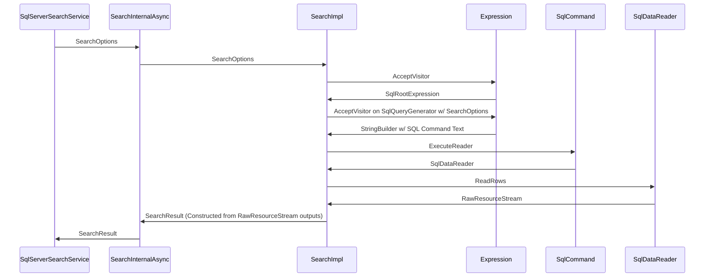

Generated SQL contains a value-free FHIR query shape. When SQL query-plan reuse is disabled and the generator
emits its existing parameter hash comment, the shape is added to the same comment:

```sql
/* HASH <parameter-hash> params=@p0,@p1 fhir=Patient?birthdate&name */
```

When no parameter hash comment is emitted, including when query-plan reuse is enabled, the shape is emitted as
a standalone comment instead:

```sql
/* fhir=Patient?birthdate&name */
```

The standalone comment makes the normalized FHIR search shape visible in Query Store and keeps the executed SQL
text stable across value changes and input parameter ordering while distinguishing different normalized shapes.
The internal custom-query hash continues to be calculated from the unannotated SQL.

The shape is created by `SearchOptionsFactory` from the search scope and the parsed query parameter names
already supplied to the search pipeline. Ordinary searches use `Patient?...`, history searches use
`Patient/_history?...`, and compartment searches omit the compartment ID and use
`Patient/$compartment/Observation?...`. Names are sorted using ordinal ordering and repeated names are retained,
so changing parameter values or query-string order does not change the annotation. Parameter values and
compartment IDs are never included. Unsafe comment/control characters are replaced, and output longer than 256
characters is truncated to 255 characters plus `~`.

This SQL generation path is used by ordinary, compartment, and history searches, including the internal
search phases used by Patient `$everything`. The annotation describes the generated target-resource query
shape; it does not attempt to identify the originating HTTP operation. Include and reverse-include syntax is
preserved when those parameter names are present.