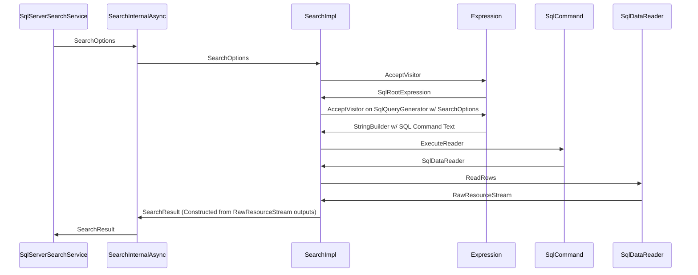

```mermaid
sequenceDiagram
    SqlServerSearchService->>SearchInternalAsync: SearchOptions
    SearchInternalAsync->>SearchImpl: SearchOptions
    SearchImpl->>Expression: AcceptVisitor
    Expression->>SearchImpl: SqlRootExpression
    SearchImpl->>Expression: AcceptVisitor on SqlQueryGenerator w/ SearchOptions
    Expression->>SearchImpl: StringBuilder w/ SQL Command Text
    SearchImpl->>SqlCommand: ExecuteReader
    SqlCommand->>SearchImpl: SqlDataReader
    SearchImpl->>SqlDataReader: ReadRows
    SqlDataReader->>SearchImpl: RawResourceStream
    SearchImpl->>SearchInternalAsync: SearchResult (Constructed from RawResourceStream outputs)
    SearchInternalAsync->>SqlServerSearchService: SearchResult
```

Generated SQL includes a value-free FHIR query shape. When the generator emits its existing parameter hash
comment with SQL query-plan reuse disabled, the shape is added without changing that comment's location:

```sql
/* HASH <parameter-hash> params=@p0,@p1 fhir=Patient?birthdate&name */
```

When no parameter hash comment is emitted, including when query-plan reuse is enabled or there are no
parameters to hash, the generator inserts only a shape comment at the equivalent in-statement location:

```sql
WITH cte0 AS (...)
/* fhir=Patient?birthdate&name */
SELECT ... FROM cte0
```

For shape-only queries without a CTE, the comment follows `SELECT`, including count queries. Include queries
annotate both the filtering `INSERT ... SELECT` statement and the subsequent resource-selection statement.
No standalone shape comment is prepended to the batch or appended after a statement: Query Store retains
the in-statement shape-only comments, so the existing slow-query text lookup can match those statements.

The generator records insertion positions without changing the SQL. After SQL simplification, the internal
custom-query hash is calculated from exactly the unannotated SQL, then the shape annotations are inserted.
Parameter-value hashing and custom-query lookup are unchanged.

With query-plan reuse enabled, identical SQL and normalized shapes remain identical across parameter-value
and input-name-order changes. Different shapes produce different SQL text and may use separate plan-cache
entries even with reuse enabled. The shape-only comment does not add a parameter-value hash.

The shape is created by `SearchOptionsFactory` from the search scope and the parsed query parameter names
already supplied to the search pipeline. Ordinary searches use `Patient?...`, history searches use
`Patient/_history?...`, and compartment searches omit the compartment ID and use
`Patient/$compartment/Observation?...`. Names are sorted using ordinal ordering and repeated names are retained,
so changing parameter values or query-string order does not change the annotation. Parameter values and
compartment IDs are never included. Unsafe comment/control characters are replaced, and output longer than 1024
characters is truncated to 1023 characters plus `~`.

This SQL generation path is used by ordinary, compartment, and history searches, including the internal
search phases used by Patient `$everything`. The annotation describes the generated target-resource query
shape; it does not attempt to identify the originating HTTP operation. Include and reverse-include syntax is
preserved when those parameter names are present.

## Independent chained searches

[FHIR R4 chained parameters](https://hl7.org/fhir/R4/search.html#chaining) are evaluated independently.
For example, a date-qualified referenced target and a target satisfying a terminal reference predicate
need not be the same resource when those predicates come from separate chained parameters. Repeated
date bounds supplied as separate chained parameters are also independent. Predicates within a single
chain remain bound to its target; nested chain links continue from that target.

The parser creates separate `ChainedExpression` instances, and `ChainFlatteningRewriter` emits a
level-one traversal for each. These repeated traversals are intentional; merging them would change
the result contract. SQL generation normally intersects source keys with `EXISTS`, but switches to
joins for queries with more than five table expressions or when retrying an optimizer compilation
failure. Previously, that fallback multiplied all preceding target matches into each new traversal:

```sql
JOIN cte4 ON refSource.ResourceTypeId = T1 AND refSource.ResourceSurrogateId = Sid1
```

At a level-one chain restart the predecessor now supplies unique source keys:

```sql
JOIN (SELECT DISTINCT T1, Sid1 FROM cte4) predecessor
  ON refSource.ResourceTypeId = T1 AND refSource.ResourceSurrogateId = Sid1
```

This is a source-existence semijoin expressed as a join to a distinct key set. It retains the
compilation fallback without carrying predecessor multiplicity or binding its `T2`/`Sid2` target.
Reverse chain restarts use the same distinct source-key intersection. Joins within a chain,
target history/deletion predicates, terminal reference type predicates (including nullable types),
and final resource deduplication are unchanged. No resource type or search parameter IDs are special-cased.

The optimization is enabled by default. For a customer rollback, set
`FhirSqlServer:EnableChainSourceDeduplication` to `false` (environment variable
`FhirSqlServer__EnableChainSourceDeduplication=false`). This restores the original predecessor joins
in both SQL search generation paths, including optimizer retries, without changing search predicates.
Apply it through the deployment's usual configuration/restart process. The flag is deployment-wide,
not a request header or per-search setting.

`SqlChainedSearchGenerationTests` executes the generated reference/token/date/reference shape on
connection-local SQL tables, compares result IDs with the original join shape, and measures rows at
each traversal. Its 128 matching reference rows reproduce over two million rows at the third
traversal before the change; each traversal now produces only 130 rows.