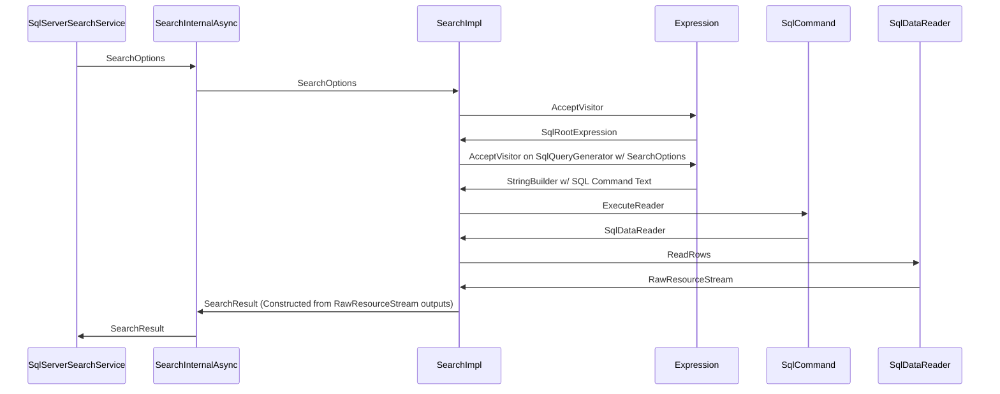

```mermaid
sequenceDiagram
    SqlServerSearchService->>SearchInternalAsync: SearchOptions
    SearchInternalAsync->>SearchImpl: SearchOptions
    SearchImpl->>Expression: AcceptVisitor
    Expression->>SearchImpl: SqlRootExpression
    SearchImpl->>Expression: AcceptVisitor on SqlQueryGenerator w/ SearchOptions
    Expression->>SearchImpl: StringBuilder w/ SQL Command Text
    SearchImpl->>SqlCommand: ExecuteReader
    SqlCommand->>SearchImpl: SqlDataReader
    SearchImpl->>SqlDataReader: ReadRows
    SqlDataReader->>SearchImpl: RawResourceStream
    SearchImpl->>SearchInternalAsync: SearchResult (Constructed from RawResourceStream outputs)
    SearchInternalAsync->>SqlServerSearchService: SearchResult
```

Generated SQL includes a value-free FHIR query shape. When the generator emits its existing parameter hash
comment with SQL query-plan reuse disabled, the shape is added without changing that comment's location:

```sql
/* HASH <parameter-hash> params=@p0,@p1 fhir=Patient?birthdate&name */
```

When no parameter hash comment is emitted, including when query-plan reuse is enabled or there are no
parameters to hash, the generator inserts only a shape comment at the equivalent in-statement location:

```sql
WITH cte0 AS (...)
/* fhir=Patient?birthdate&name */
SELECT ... FROM cte0
```

For shape-only queries without a CTE, the comment follows `SELECT`, including count queries. Include queries
annotate both the filtering `INSERT ... SELECT` statement and the subsequent resource-selection statement.
No standalone shape comment is prepended to the batch or appended after a statement: Query Store retains
the in-statement shape-only comments, so the existing slow-query text lookup can match those statements.

The generator records insertion positions without changing the SQL. After SQL simplification, the internal
custom-query hash is calculated from exactly the unannotated SQL, then the shape annotations are inserted.
Parameter-value hashing and custom-query lookup are unchanged.

With query-plan reuse enabled, identical SQL and normalized shapes remain identical across parameter-value
and input-name-order changes. Different shapes produce different SQL text and may use separate plan-cache
entries even with reuse enabled. The shape-only comment does not add a parameter-value hash.

The shape is created by `SearchOptionsFactory` from the search scope and the parsed query parameter names
already supplied to the search pipeline. Ordinary searches use `Patient?...`, history searches use
`Patient/_history?...`, and compartment searches omit the compartment ID and use
`Patient/$compartment/Observation?...`. Names are sorted using ordinal ordering and repeated names are retained,
so changing parameter values or query-string order does not change the annotation. Parameter values and
compartment IDs are never included. Unsafe comment/control characters are replaced, and output longer than 1024
characters is truncated to 1023 characters plus `~`.

This SQL generation path is used by ordinary, compartment, and history searches, including the internal
search phases used by Patient `$everything`. The annotation describes the generated target-resource query
shape; it does not attempt to identify the originating HTTP operation. Include and reverse-include syntax is
preserved when those parameter names are present.