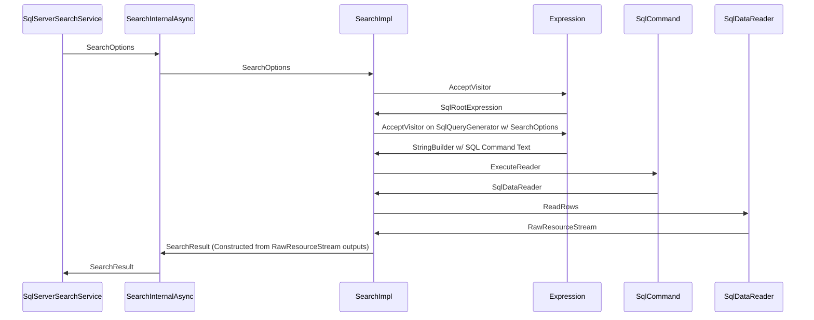

```mermaid
sequenceDiagram
    SqlServerSearchService->>SearchInternalAsync: SearchOptions
    SearchInternalAsync->>SearchImpl: SearchOptions
    SearchImpl->>Expression: AcceptVisitor
    Expression->>SearchImpl: SqlRootExpression
    SearchImpl->>Expression: AcceptVisitor on SqlQueryGenerator w/ SearchOptions
    Expression->>SearchImpl: StringBuilder w/ SQL Command Text
    SearchImpl->>SqlCommand: ExecuteReader
    SqlCommand->>SearchImpl: SqlDataReader
    SearchImpl->>SqlDataReader: ReadRows
    SqlDataReader->>SearchImpl: RawResourceStream
    SearchImpl->>SearchInternalAsync: SearchResult (Constructed from RawResourceStream outputs)
    SearchInternalAsync->>SqlServerSearchService: SearchResult
```

Generated SQL includes a value-free FHIR query shape only when the generator emits its existing parameter hash
comment with SQL query-plan reuse disabled. The shape is added to the same comment:

```sql
/* HASH <parameter-hash> params=@p0,@p1 fhir=Patient?birthdate&name */
```

When no parameter hash comment is emitted, including when query-plan reuse is enabled, the SQL is left
unchanged. Different query shapes therefore do not introduce additional SQL text variants on this path.
No standalone shape comment is prepended: Query Store omits leading batch comments, even though they change
the plan cache key and would prevent the slow-query text lookup from matching the saved statement text.
The existing hash comments are embedded within statements and retained by Query Store.
The internal custom-query hash continues to be calculated from the unannotated SQL on both paths.

The shape is created by `SearchOptionsFactory` from the search scope and the parsed query parameter names
already supplied to the search pipeline. Ordinary searches use `Patient?...`, history searches use
`Patient/_history?...`, and compartment searches omit the compartment ID and use
`Patient/$compartment/Observation?...`. Names are sorted using ordinal ordering and repeated names are retained,
so changing parameter values or query-string order does not change the annotation. Parameter values and
compartment IDs are never included. Unsafe comment/control characters are replaced, and output longer than 1024
characters is truncated to 1023 characters plus `~`.

This SQL generation path is used by ordinary, compartment, and history searches, including the internal
search phases used by Patient `$everything`. The annotation describes the generated target-resource query
shape; it does not attempt to identify the originating HTTP operation. Include and reverse-include syntax is
preserved when those parameter names are present.