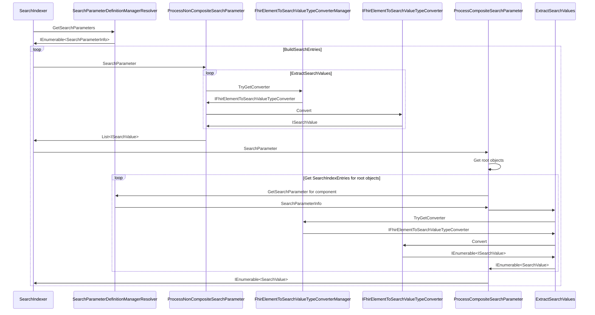

```mermaid
sequenceDiagram
    SearchIndexer->>SearchParameterDefinitionManagerResolver: GetSearchParameters
    SearchParameterDefinitionManagerResolver->>SearchIndexer: IEnumerable<SearchParameterInfo>
    loop BuildSearchEntries
        SearchIndexer->>ProcessNonCompositeSearchParameter: SearchParameter
        loop ExtractSearchValues
            ProcessNonCompositeSearchParameter->>FhirElementToSearchValueTypeConverterManager: TryGetConverter
            FhirElementToSearchValueTypeConverterManager->>ProcessNonCompositeSearchParameter: IFhirElementToSearchValueTypeConverter
            ProcessNonCompositeSearchParameter->>IFhirElementToSearchValueTypeConverter: Convert
            IFhirElementToSearchValueTypeConverter->>ProcessNonCompositeSearchParameter: ISearchValue
        end
        ProcessNonCompositeSearchParameter->>SearchIndexer: List<ISearchValue>
        SearchIndexer->>ProcessCompositeSearchParameter: SearchParameter
            ProcessCompositeSearchParameter->>ProcessCompositeSearchParameter: Get root objects
            loop Get SearchIndexEntries for root objects
                ProcessCompositeSearchParameter->>SearchParameterDefinitionManagerResolver: GetSearchParameter for component
                SearchParameterDefinitionManagerResolver->>ProcessCompositeSearchParameter: SearchParameterInfo
                ProcessCompositeSearchParameter->>ExtractSearchValues: 
                ExtractSearchValues->>FhirElementToSearchValueTypeConverterManager: TryGetConverter
                FhirElementToSearchValueTypeConverterManager->>ExtractSearchValues: IFhirElementToSearchValueTypeConverter
                ExtractSearchValues->>IFhirElementToSearchValueTypeConverter: Convert
                IFhirElementToSearchValueTypeConverter->>ExtractSearchValues: IEnumerable<ISearchValue>
                ExtractSearchValues->>ProcessCompositeSearchParameter: IEnumerable<SearchValue>
            end
        ProcessCompositeSearchParameter->>SearchIndexer: IEnumerable<SearchValue>
    end
```