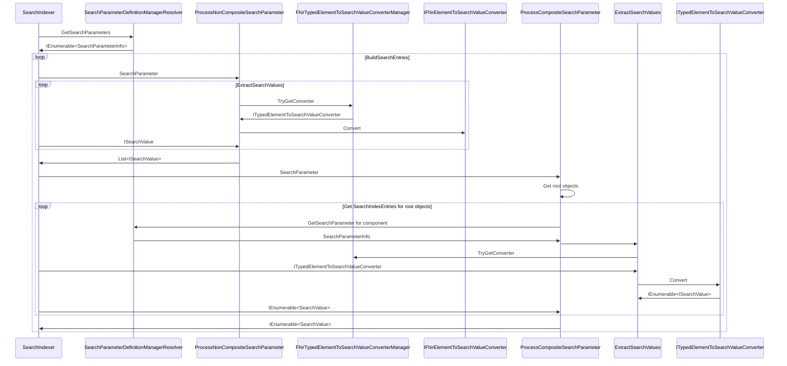

```mermaid
sequenceDiagram
    SearchIndexer->>SearchParameterDefinitionManagerResolver: GetSearchParameters
    SearchParameterDefinitionManagerResolver->>SearchIndexer: IEnumerable<SearchParameterInfo>
    loop BuildSearchEntries
        SearchIndexer->>ProcessNonCompositeSearchParameter: SearchParameter
        loop ExtractSearchValues
            ProcessNonCompositeSearchParameter->>FhirTypedElementToSearchValueConverterManager: TryGetConverter
            FhirTypedElementToSearchValueConverterManager->>ProcessNonCompositeSearchParameter: ITypedElementToSearchValueConverter
            ProcessNonCompositeSearchParameter->>IFhirElementToSearchValueConverter: Convert
            SearchIndexer->>ProcessNonCompositeSearchParameter: ISearchValue
        end
        ProcessNonCompositeSearchParameter->>SearchIndexer: List<ISearchValue>
        SearchIndexer->>ProcessCompositeSearchParameter: SearchParameter
            ProcessCompositeSearchParameter->>ProcessCompositeSearchParameter: Get root objects
            loop Get SearchIndexEntries for root objects
                ProcessCompositeSearchParameter->>SearchParameterDefinitionManagerResolver: GetSearchParameter for component
                SearchParameterDefinitionManagerResolver->>ProcessCompositeSearchParameter: SearchParameterInfo
                ProcessCompositeSearchParameter->>ExtractSearchValues: 
                ExtractSearchValues->>FhirTypedElementToSearchValueConverterManager: TryGetConverter
                SearchIndexer->>ExtractSearchValues: ITypedElementToSearchValueConverter
                ExtractSearchValues->>ITypedElementToSearchValueConverter: Convert
                ITypedElementToSearchValueConverter->>ExtractSearchValues: IEnumerable<ISearchValue>
                SearchIndexer->>ProcessCompositeSearchParameter: IEnumerable<SearchValue>
            end
        ProcessCompositeSearchParameter->>SearchIndexer: IEnumerable<SearchValue>
    end
```
