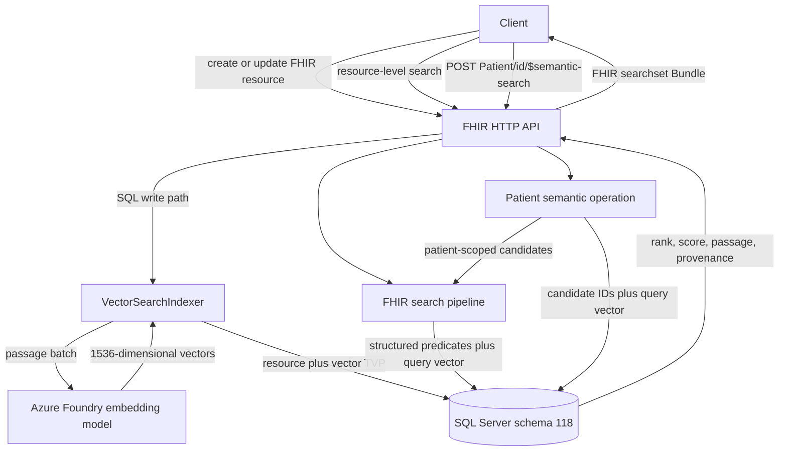
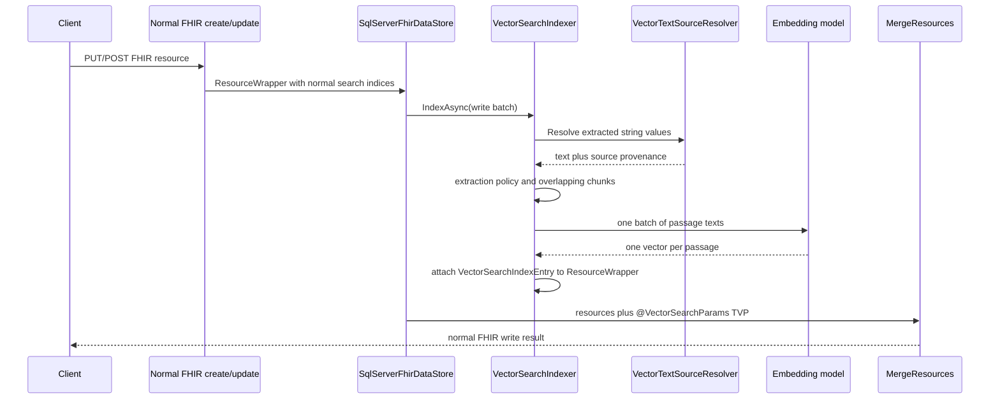
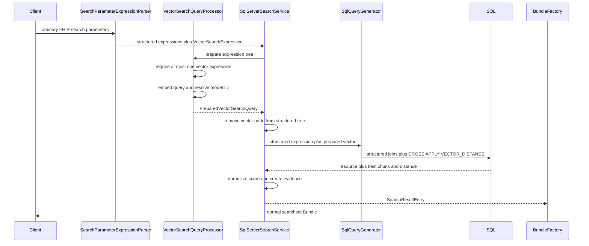

# SQL Semantic Search: Architecture And Flows

This guide explains the design in layers. Read the first two sections before
opening code. The later sections provide exact classes and line anchors for a
deeper implementation discussion.

## 1. Problem And Design

FHIR search is strong at deterministic questions:

- Which patient owns the resource?
- What resource type is it?
- Does it match a date, code, category, encounter, or author constraint?

FHIR search does not determine which narrative passage is most relevant to a
concept-oriented question. This implementation combines the two concerns:

> Deterministic FHIR search establishes the eligible resource set. Vector
> similarity ranks configured narrative content inside that set.

The feature deliberately does not generate a clinical answer. It retrieves and
ranks FHIR resources and returns the passage that explains each match.

## 2. Four-Stage Mental Model

### Configure

Two related configurations are required:

1. **Server configuration** enables the feature and selects the embedding model,
  default chunk sizes, candidate count, result limits, and extraction bounds.
2. **FHIR SearchParameter definitions** specify which expression supplies text
   and carry a vector extension that controls extraction and source resolution.

These are not duplicates. Server configuration owns deployment-wide operational
settings. Active, supported, searchable SearchParameter resources in the live
registry define which resource fields are eligible for vector indexing and
search.

### Ingest And Index

FHIR resources are still created or updated through normal FHIR interactions.
On the SQL write path, enabled SearchParameters provide extracted string values.
The feature resolves those values to text, chunks them, generates embeddings,
and adds vector rows to the same SQL merge operation as the resource.

### Search

There are two supported entry points:

- a vector-enabled parameter in ordinary resource-level FHIR search;
- a custom patient operation for one globally ranked mixed-resource result set.

Both embed the query and use SQL cosine distance. They differ in how they obtain
candidates and assemble the response.

### Verify

Each result can expose:

- normalized relevance score;
- exact winning chunk text;
- chunk ordinal;
- page-scoped evidence rank;
- SearchParameter canonical URL;
- source resource reference;
- source FHIR path.

## 3. System Context



## 4. Configuration Contract

The root object is
[VectorSearchConfiguration](../../../src/Microsoft.Health.Fhir.Core/Configs/VectorSearchConfiguration.cs#L14).
Its validation starts at
[Validate](../../../src/Microsoft.Health.Fhir.Core/Configs/VectorSearchConfiguration.cs#L48).

Important invariants:

- the feature does nothing when `Enabled` is false;
- the embedding endpoint must be absolute HTTPS;
- deployment name, model name, and model version are required;
- embeddings and SQL must use exactly 1536 dimensions;
- only synchronous indexing is currently supported;
- chunk overlap must be smaller than chunk size;
- candidate count must be at least the maximum result count;
- only cosine distance is supported.

The checked-in defaults are visible in
[appsettings.json](../../../src/Microsoft.Health.Fhir.Shared.Web/appsettings.json#L31):

| Setting | Default | Meaning |
|---|---:|---|
| `Enabled` | `false` | Feature is opt-in. |
| `Dimensions` | `1536` | Must match SQL `vector(1536)`. |
| `Indexing.Mode` | `Synchronous` | Embeddings are generated on the write path. |
| `ChunkSizeTokens` | `800` | Configured window size; currently interpreted as characters. |
| `ChunkOverlapTokens` | `100` | Configured overlap; currently interpreted as characters. |
| `Query.DefaultCount` | `10` | Results when count is omitted. |
| `Query.MaxCount` | `50` | Request upper bound. |
| `Query.CandidateCount` | `100` | Per-type patient candidates fetched before ranking. |
| `DistanceMetric` | `cosine` | SQL distance calculation and score normalization. |

The `*Tokens` setting names describe the intended abstraction, but
[TextChunker](../../../src/Microsoft.Health.Fhir.Core/Features/Search/SemanticSearch/TextChunker.cs#L15)
currently implements a fixed sliding **character** window. There is no model
tokenizer in the current implementation. Token-aware chunking is production
follow-up work.

The vector extension model is
[VectorSearchParameterConfig](../../../src/Microsoft.Health.Fhir.Core/Models/VectorSearchParameterConfig.cs#L11):

```text
http://microsoft.com/fhir/StructureDefinition/vector-search-config
  extractionPolicy = FirstValue | Concatenate | PerValueRow
  sourceStrategy    = DirectText | LocalBinaryReference
  maxInputTokens    = positive integer, default 8000
  chunkSizeTokens   = optional positive integer
  chunkOverlapTokens = optional non-negative integer smaller than chunk size
  distanceMetric    = optional cosine value
```

[SearchParameterWrapper.ParseVectorConfig](../../../src/Microsoft.Health.Fhir.Core/Features/Definition/BundleWrappers/SearchParameterWrapper.cs#L75)
reads and validates that nested extension. A malformed enum or non-positive
`maxInputTokens` rejects the SearchParameter definition.

### Why `type=special`?

The parameter accepts natural-language query text but has non-standard matching
semantics. Marking it `special` avoids pretending it follows ordinary FHIR
string search rules. The parser recognizes `special` plus vector configuration
and creates a dedicated `VectorSearchExpression`.

### What “register the SearchParameter” means

The deployed FHIR server must know an active SearchParameter resource. This puts
its canonical, code, base resource type, and expression in the normal
SearchParameter registry and SQL model. Once its operational status is supported
and searchable, the vector resolver can use it for indexing and querying.

## 5. Write-Time Indexing Flow



### Entry point

[SqlServerFhirDataStore](../../../src/Microsoft.Health.Fhir.SqlServer/Features/Storage/SqlServerFhirDataStore.cs#L460)
calls `IVectorSearchIndexer.IndexAsync` before executing the merge. At
[the SQL command setup](../../../src/Microsoft.Health.Fhir.SqlServer/Features/Storage/SqlServerFhirDataStore.cs#L853),
vector rows are passed as `@VectorSearchParams` alongside normal search-index
TVPs.

### Indexer responsibilities

[VectorSearchIndexer.IndexAsync](../../../src/Microsoft.Health.Fhir.Core/Features/Search/SemanticSearch/VectorSearchIndexer.cs#L60):

1. clears stale in-memory vector entries for every write candidate;
2. skips deleted and historical wrappers;
3. obtains enabled vector SearchParameters for the resource type;
4. reads the SearchParameter's already-extracted string search values;
5. resolves each value to direct text or a linked local Binary;
6. applies `FirstValue`, `Concatenate`, or `PerValueRow`;
7. selects per-parameter chunk size and overlap when present, otherwise uses
  the global defaults, caps the size by per-parameter `maxInputTokens`, and
  applies the resulting values as character counts in the current chunker;
8. sends every pending passage in one embedding batch;
9. validates one correctly sized embedding per passage;
10. calculates SHA-256 over exact passage text;
11. builds chunks carrying text, vector, ordinal, and source provenance;
12. attaches grouped `VectorSearchIndexEntry` objects to each ResourceWrapper.

The embedding call is intentionally batched across the write collection. The
implementation is synchronous: an embedding failure prevents the SQL merge
rather than silently writing an unindexed current resource.

### Direct text

With `DirectText`, extracted SearchParameter strings become passages owned by
the FHIR resource. The source path is the SearchParameter expression. This is
the demo path for:

- `Observation.note.text`;
- `DiagnosticReport.conclusion`.

### Binary-backed DocumentReference

[VectorTextSourceResolver.ResolveAsync](../../../src/Microsoft.Health.Fhir.Core/Features/Search/SemanticSearch/VectorTextSourceResolver.cs#L42)
implements `LocalBinaryReference`:

1. accept only relative references exactly shaped as `Binary/{id}`;
2. prefer the newest matching Binary in the current write batch;
3. otherwise read the persisted Binary through `IVectorResourceReader`;
4. reject missing, deleted, or historical Binary resources;
5. select a registered `IBinaryContentExtractor` by normalized MIME type;
6. decode strict UTF-8 `text/plain` or extract text-based `application/pdf`
  content page by page with PdfPig;
7. apply extractor-specific file, page, character, and elapsed-time limits;
8. reject malformed, encrypted, empty, scanned-only, or over-limit content;
9. report provenance as the Binary resource and `Binary.data`, with PDF page
  locators such as `Binary.data#page=1`.

The narrow `IVectorResourceReader` avoids injecting the full FHIR data store
back into indexing and creating a dependency-injection cycle.

## 6. SQL Persistence Model

Schema version 117 introduced the embedding model and vector passage storage.
Schema version 118 adds transactional vector replacement to `$reindex` through
`UpdateResourceSearchParamsWithVectors` while preserving the schema 117
procedure for rolling compatibility.

### Embedding model identity

[EmbeddingModel.sql](../../../src/Microsoft.Health.Fhir.SqlServer/Features/Schema/Sql/Tables/EmbeddingModel.sql#L2)
stores model name, version, dimensions, distance metric, and creation time. A
small integer model ID is attached to every vector row so query vectors are only
compared with vectors generated by the same model registration.

### Passage rows

[VectorSearchParam.sql](../../../src/Microsoft.Health.Fhir.SqlServer/Features/Schema/Sql/Tables/VectorSearchParam.sql#L1)
stores:

| Column group | Purpose |
|---|---|
| owner identity | `ResourceTypeId`, `ResourceSurrogateId` |
| index identity | `SearchParamId`, `ChunkOrdinal`, `EmbeddingModelId` |
| explainability | `ChunkText`, `SourceTextHash` |
| provenance | source resource type, ID, version, and path |
| ranking | `Embedding vector(1536)` |

The clustered primary key is owner resource, SearchParameter, then chunk
ordinal. The merge stored procedure removes old vector rows when replacing the
current resource and inserts the new TVP rows as part of resource persistence.

## 7. Resource-Level Semantic And Hybrid Search

Conceptual request:

```http
GET /Observation?patient=example&note-semantic=similar dizziness after standing
```

The actual parameter code depends on the registered SearchParameter definition.



[VectorSearchQueryProcessor.PrepareAsync](../../../src/Microsoft.Health.Fhir.Core/Features/Search/SemanticSearch/VectorSearchQueryProcessor.cs#L37)
collects vector expressions, allows zero or one, validates dimensions, embeds
the query once, and returns a `PreparedVectorSearchQuery`.

[SqlServerSearchService](../../../src/Microsoft.Health.Fhir.SqlServer/Features/Search/SqlServerSearchService.cs#L188)
prepares the vector query and removes the vector node before ordinary SQL search
expression generation. This leaves structured predicates to define candidates.

[SqlQueryGenerator.AppendVectorSearchApply](../../../src/Microsoft.Health.Fhir.SqlServer/Features/Search/Expressions/Visitors/QueryGenerators/SqlQueryGenerator.cs#L454)
adds a correlated `CROSS APPLY` that:

- matches vector rows to each eligible resource;
- requires the selected SearchParameter and embedding model;
- calculates cosine distance;
- orders chunks by distance and ordinal;
- returns only the best chunk for that resource;
- orders final resources by distance, then stable resource identifiers.

The search service converts the winning distance to a bounded score and creates
`SemanticSearchEvidence` before returning an ordinary `SearchResultEntry`.
[BundleFactory](../../../src/Microsoft.Health.Fhir.Shared.Core/Features/Search/BundleFactory.cs#L47)
places score and evidence on `Bundle.entry.search`.

## 8. Patient-Wide Mixed-Resource Operation

Request shape:

```http
POST /Patient/patient-a/$semantic-search
Content-Type: application/fhir+json

{
  "resourceType": "Parameters",
  "parameter": [
    { "name": "query", "valueString": "Has this patient had similar dizziness or near-syncope before?" },
    { "name": "count", "valueInteger": 10 },
    { "name": "type", "valueCode": "Observation" },
    { "name": "type", "valueCode": "DocumentReference" }
  ]
}
```

If `type` is omitted, all three supported types are searched:

- `DocumentReference`;
- `Observation`;
- `DiagnosticReport`.

### Stage 1: HTTP validation

[SemanticSearchController.Search](../../../src/Microsoft.Health.Fhir.Shared.Api/Controllers/SemanticSearchController.cs#L61)
requires nonblank query text, validates count against configuration, rejects
unsupported resource types, derives the patient reference from the route, and
dispatches a MediatR request.

### Stage 2: Candidate eligibility

[SemanticSearchHandler.Handle](../../../src/Microsoft.Health.Fhir.Shared.Core/Features/Search/SemanticSearch/SemanticSearchHandler.cs#L66):

1. requires FHIR read authorization;
2. runs ordinary `patient=Patient/{id}` search separately for each selected type;
3. limits each search to configured `CandidateCount`;
4. applies `IDataResourceFilter`;
5. retains only normal match entries.

This is the deterministic boundary. Patient B cannot win Patient A's search even
if Patient B contains a perfect text match.

### Stage 3: Global semantic ranking

[SqlDocumentReferenceSemanticSearch.SearchAsync](../../../src/Microsoft.Health.Fhir.SqlServer/Features/Search/SemanticSearch/SqlDocumentReferenceSemanticSearch.cs#L52)
has a legacy DocumentReference-specific name but now handles mixed candidates:

1. embed query text once;
2. group candidate surrogate IDs by resource type;
3. search every enabled vector SearchParameter for each type;
4. construct evidence from the persisted source provenance;
5. de-duplicate by `(ResourceTypeName, ResourceSurrogateId)` and keep the best
   SearchParameter hit for each resource;
6. globally sort all resource types by score and apply the requested count.

The composite identity matters because SQL surrogate IDs are not treated as
globally unique across heterogeneous resource types.

### Stage 4: FHIR response

The handler maps ranked identities back to authorized candidates and returns a
`searchset` Bundle. Each entry contains the complete FHIR resource, match mode,
score, and semantic evidence extension.

## 9. Evidence And Score Semantics

Evidence is defined by
[SemanticSearchEvidence](../../../src/Microsoft.Health.Fhir.Core/Features/Search/SemanticSearch/SemanticSearchEvidence.cs#L12).
The Bundle extension contains:

- `text`: exact winning indexed chunk;
- `chunkOrdinal`: position among that parameter's chunks;
- `rank`: one-based relevance rank across evidence on the current response page;
- `searchParameter`: canonical URL that selected the source;
- `source`: version-aware owner or Binary reference;
- `sourcePath`: expression, `Binary.data`, or a segmented locator such as
  `Binary.data#page=1`.

For Binary-backed DocumentReference, the Bundle entry is the DocumentReference,
while evidence points to the Binary that supplied the text. This distinction is
one of the most important design details to explain.

The score is a transformation of cosine distance used for ordering. It is not:

- a probability;
- clinical confidence;
- an assertion that the passage is medically correct;
- comparable across arbitrary embedding models.

For the demo, an Observation whose indexed text exactly equals the query should
produce a score close to 1 with the same embedding model. A paraphrase should
rank strongly but usually lower, and irrelevant text should rank lower still.

## 10. FHIR Standards Boundary

### Standard or FHIR-native pieces

- FHIR resources remain the stored clinical data.
- SearchParameter resources define expressions and parameter identity.
- ordinary resource-level search remains the base search interaction;
- deterministic parameters such as `patient` establish scope;
- results use a `searchset` Bundle and `Bundle.entry.search.score`;
- extensions carry additional semantic evidence.

### Custom pieces

- the vector configuration extension is Microsoft-defined;
- vector matching semantics for `type=special` are implementation-specific;
- `POST /Patient/{id}/$semantic-search` is a custom operation;
- mixed-resource global semantic ranking is not a standard FHIR search
  interaction.

The operation should be described as extending FHIR, not as a new standard FHIR
capability.

## 11. Important Design Decisions

| Decision | Reason |
|---|---|
| SearchParameter-driven extraction | Reuses FHIR's configurable search-definition model and avoids hard-coded resource-specific indexers. |
| SQL-only initial scope | SQL Server supplies native vector storage and distance calculation; Cosmos was intentionally not implemented. |
| Synchronous indexing | Current consistency contract: a successful write has matching current vectors. |
| Model registry ID on rows | Prevents comparing query vectors against vectors generated by another model version. |
| Best chunk per resource | Returns a resource-level result while preserving the strongest explanatory passage. |
| Structured candidates before ranking | Preserves deterministic patient/resource boundaries and limits vector work. |
| Persist passage and provenance | Makes ranking inspectable and lets the response point to the actual Binary source. |
| Custom Patient operation | Standard FHIR does not provide heterogeneous semantic ranking in one result order. |

## 12. Current Scope And Limitations

### Appropriate for the controlled SQL demo

- SQL schema 118;
- Azure Foundry embeddings;
- synchronous write-time indexing;
- vector-aware `$reindex` for existing resources and newly activated definitions;
- direct Observation and DiagnosticReport text;
- UTF-8 text/plain and text-based PDF local Binary referenced by DocumentReference;
- resource-level semantic/hybrid search;
- resource-level score sorting, ordinary FHIR sort precedence, and stable semantic continuation tokens;
- patient-wide ranking over three resource types;
- scores, ranked passages, and provenance.

### Deferred production work

- reindex owning DocumentReferences when a referenced Binary changes or is
  deleted;
- independently authorize linked Binary evidence before exposing its text;
- asynchronous indexing and retry/recovery policy;
- Cosmos implementation;
- patient-operation continuation pagination beyond the bounded candidate pool;
- date, encounter, author, category, or specialty parameters on the custom
  operation;
- OCR for scanned PDFs and extraction support for CDA, RTF, Word, image, or audio;
- performance/load testing, telemetry, and operational alerting.

### Validation status

- Core, handler, controller, SQL query-generation, indexing, reindex, and Bundle
  serialization behavior have automated coverage;
- live local validation has proven resource ingestion, SQL vector persistence,
  direct and Binary-backed search, patient isolation, PDF page provenance, and
  vector-aware `$reindex` on schema 118;
- the current release checkpoint still requires one final R4 build and live
  rehearsal on the exact commit set.

## 13. What To Draw By Hand

Draw these two diagrams from memory:

```text
WRITE
FHIR resource -> SearchParameter text -> source resolver -> chunks -> embeddings
              -> ResourceWrapper vector entries -> SQL merge TVP

QUERY
FHIR patient/type filters -> authorized candidate IDs -> one query embedding
                          -> SQL cosine ranking -> best chunk/resource
                          -> Bundle score + evidence
```

If you can explain every arrow and name the owning class, you understand the
implementation at the right level for a technical review.