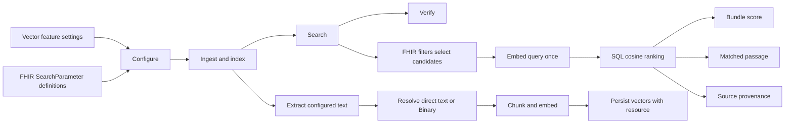

# SQL Semantic Search Learning Guide

This study pack explains the semantic-search implementation in commit
`286cb45a3` from the outside in. It is intentionally split into layers so you
can explain the design before discussing implementation details.

## The One-Sentence Explanation

Microsoft FHIR Server first uses deterministic FHIR search to identify eligible
resources, then uses embeddings stored in SQL Server to rank configured clinical
text by semantic similarity while returning the matched passage and its source.

## The Mental Model



The feature has two query surfaces:

1. **Resource-level semantic/hybrid search** integrates a vector-enabled
   SearchParameter into the existing FHIR search pipeline.
2. **Patient-wide semantic search** uses
   `POST /Patient/{id}/$semantic-search` to rank supported resource types in one
   mixed Bundle.

## What You Should Be Able To Explain

Start with these claims. Everything deeper in the study pack supports them.

1. Vector search does not replace FHIR search. Structured FHIR constraints
   determine eligibility; vectors determine relevance.
2. SearchParameter resources make text selection configuration-driven instead
   of hard-coding every resource field.
3. Indexing happens when a FHIR resource is written. Configured text is
   extracted, resolved, chunked, embedded, and stored transactionally with the
   SQL resource write.
4. `DirectText` supports fields such as `Observation.note.text` and
   `DiagnosticReport.conclusion`.
5. `LocalBinaryReference` lets a DocumentReference index UTF-8 `text/plain` or text-based PDF
   content from a referenced local Binary.
6. A query is embedded once. SQL Server calculates cosine distance against
   eligible chunks and keeps the strongest passage for each resource.
7. Results remain traceable through `Bundle.entry.search.score` and a semantic
   evidence extension containing the passage, SearchParameter canonical, source
   reference, and source path.
8. Mixed-resource semantic ranking is a custom FHIR operation because standard
   FHIR does not define global semantic ranking across heterogeneous resources.
9. The current demonstration scope is SQL only and supports Observation,
   DiagnosticReport, and DocumentReference in the patient operation.
10. Production hardening such as Binary-dependent reindexing, linked-source
   authorization, patient-operation pagination, telemetry, and Cosmos support
   is deferred.

## Read These Guides In Order

1. [Architecture and Flows](ArchitectureAndFlows.md): design intent, diagrams,
   FHIR boundaries, and complete request flows.
2. [Implementation Inventory](ImplementationInventory.md): every file changed in
   commit `286cb45a3`, why it changed, and the files worth reading closely.
3. [Expert Q&A](ExpertQandA.md): likely review questions, concise answers, known
   limitations, and phrases to avoid.

## A Practical Study Method

Use three passes rather than trying to memorize the repository.

### Pass 1: Tell The Story Without Code

Draw the mental-model diagram by hand and explain each box in one sentence. Do
not open source files until you can explain why configuration, indexing,
searching, and evidence are separate concerns.

### Pass 2: Trace Two Concrete Flows

Trace one write and one query:

- Write: `DocumentReference -> Binary text -> chunks -> embeddings -> SQL TVP`.
- Query: `Patient filter -> mixed candidates -> one query embedding -> SQL
  ranking -> Bundle score and evidence`.

At each step, write down the owning class and the data object passed to the next
step. This is more useful than memorizing individual statements.

### Pass 3: Defend Design Decisions

Practice answering why the implementation uses:

- SearchParameter configuration;
- `type=special`;
- SQL `vector(1536)` and cosine distance;
- structured candidate filtering before ranking;
- source provenance on every indexed chunk;
- a custom Patient operation for mixed-resource ranking;
- synchronous indexing for the current implementation.

## Suggested Physical Notes

Use six pages:

1. One-page mental model and vocabulary.
2. Configuration and SearchParameter lifecycle.
3. Write/indexing sequence.
4. Resource-level and patient-wide query sequences.
5. SQL schema and evidence/provenance.
6. Limitations, expert questions, and demo claims.

Do not copy the entire implementation inventory by hand. Mark the critical files
there, then put only their class names and responsibilities in your notebook.

## Scope And Evidence

The implementation inventory is derived from:

```powershell
git show --name-status 286cb45a3
```

That commit contains 98 changed files: production code, SQL schema, project
inclusion files, and tests. The unfinished HTTP E2E files and prior demo tools
are not part of the commit and are documented separately as follow-up work.