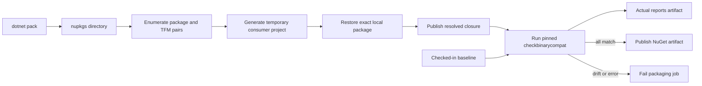

# NuGet Binary Closure Validation Design

## Summary

Add a blocking binary-closure validation gate to the NuGet packaging path used by both pull-request and continuous-integration builds. Every generated non-symbol NuGet package will be restored into temporary consumer projects, published for each supported target framework, and checked with a pinned `checkbinarycompat` tool against a checked-in baseline.

This gate detects dependency closure defects that otherwise appear only at runtime, including missing assemblies, version mismatches, missing types, and missing members. It does not replace semantic API compatibility analysis between released package versions.

## Goals

- Validate every `.nupkg` produced by the OSS packaging job, excluding `.snupkg` files.
- Validate the dependency closure that a package consumer receives after restore rather than only the assemblies embedded in the package archive.
- Run the same blocking check in PR and CI builds.
- Keep expected diagnostics in deterministic, reviewable baseline files.
- Publish actual reports when validation fails so maintainers can inspect and intentionally update baselines.
- Pin validation tooling and constrain tool installation to NuGet.org.

## Non-Goals

- Compare the public API surface with the latest package published to NuGet.org.
- Add validation to pipelines that do not produce the OSS NuGet artifact.
- Validate web deployment archives or container images.
- Automatically accept or update changed baselines.
- Refactor the existing build, test, or packaging stages beyond the shared packaging path.

## Existing Build Flow

Both `build/pr-pipeline.yml` and `build/ci-pipeline.yml` run a `BuildArtifacts` stage whose Linux packaging job invokes `build/jobs/build.yml` with `packageArtifacts: true`. That template invokes `build/jobs/package.yml`, which:

1. Packages the web applications.
2. Runs `dotnet pack` for the repository and writes packages to `$(Build.ArtifactStagingDirectory)/nupkgs`.
3. Publishes the NuGet directory as the `nuget` build artifact.

The validation belongs between steps 2 and 3. Placing it in the shared package template gives PR and CI identical behavior without pipeline-specific duplication.

## Considered Approaches

### 1. Shared post-pack validation template

Run one reusable validation step after `dotnet pack` and before artifact publication. The validator enumerates packages and target frameworks, restores each package into an isolated consumer project, publishes the closure, and validates it.

**Advantages**

- Validates the actual package artifact and its dependency metadata.
- Covers PR and CI through one shared integration point.
- Prevents invalid NuGet artifacts from being published by the build.
- Keeps Azure Pipelines orchestration separate from validation logic.
- Can be reproduced locally against a package directory.

**Disadvantages**

- Adds restore and publish work for every package/framework pair.
- Requires deterministic temporary source configuration and cleanup.

### 2. Separate validation stage

Publish the NuGet artifact, download it in another job, and validate it there.

**Advantages**

- Isolates the validation tool and workload from packaging.
- Could run independently after packaging.

**Disadvantages**

- Publishes an invalid artifact before validation completes.
- Adds artifact upload/download latency.
- Requires additional stage dependencies and wiring in both pipelines.
- Makes local reproduction less direct.

### 3. MSBuild-integrated validation

Attach validation targets to each packable project or the repository pack operation.

**Advantages**

- Makes the check visible during local `dotnet pack`.
- Associates failures closely with individual projects.

**Disadvantages**

- Couples a repository policy tool to every project build.
- Complicates tool bootstrapping, report aggregation, and baseline paths in MSBuild.
- Risks changing developer pack behavior unrelated to CI artifact production.

## Decision

Use the shared post-pack validation template.

## Components

### Pipeline step template

Add `build/steps/validate-nuget-binary-closure.yml`. It will:

- Accept package, baseline, report, and temporary-work directories as parameters.
- Install a pinned `checkbinarycompat` version using a temporary NuGet configuration containing only NuGet.org.
- Invoke the repository validation script.
- Publish the report directory as a diagnostic build artifact under `succeededOrFailed()`.

The tool version is declared once in the template and must be changed through normal code review.

### Validation script

Add a cross-platform PowerShell script under `build/scripts/`. Keeping package inspection and consumer-project generation outside inline YAML makes the behavior locally reproducible and keeps the template readable.

The script will:

1. Enumerate `.nupkg` files in ordinal order and exclude `.snupkg` files.
2. Read package ID, version, and managed target frameworks from package metadata and archive paths rather than parsing file names.
3. Reject duplicate package identities or packages without a supported managed target framework.
4. For every package/framework pair, create an isolated temporary SDK consumer application.
5. Generate a temporary NuGet configuration with:
   - The just-built package directory as the first source.
   - The repository's existing public NuGet sources.
   - Package-source mappings that allow the generated package to resolve from the local source.
6. Add an exact-version `PackageReference` to the generated package.
7. Restore and publish the consumer application.
8. Run `checkbinarycompat` against the publish directory using:
   - A package-and-framework-specific checked-in baseline.
   - A separate actual report path.
   - Assembly-list and summary/new-warning output.
   - Framework-assembly handling appropriate for SDK-style applications.
9. Aggregate failures and return a nonzero exit code after all package/framework pairs have produced reports.
10. Remove temporary consumer and restore directories in a `finally` block while preserving reports.

All command failures are surfaced. The script will not silently skip a package, framework, missing baseline, or malformed package.

### Baselines

Store baselines under `build/binarycompat/`. Use a deterministic file name based on a filesystem-safe package ID and target framework:

```text
build/binarycompat/<PackageId>.<TargetFramework>.txt
```

Each file is the sorted `checkbinarycompat` diagnostic report for that consumer closure. An empty expected report is represented by a checked-in empty file. A baseline is required for every generated package/framework pair; missing and orphaned baselines are failures so package additions, removals, and target-framework changes are explicit in review.

### Reports

Write actual output under the build artifact staging directory:

```text
binarycompat/<PackageId>/<TargetFramework>/
```

Each directory contains the actual compatibility report, analyzed assembly list, and concise comparison output. The pipeline publishes this tree even when validation fails. It must not modify checked-in baselines in place.

## Data Flow



## Pipeline Integration

Update `build/jobs/package.yml` so the order is:

1. Package web applications.
2. Pack NuGet packages.
3. Validate NuGet binary closures.
4. Publish deployment artifacts.
5. Publish the NuGet artifact.

No direct changes are required in `build/pr-pipeline.yml` or `build/ci-pipeline.yml`; both already consume the shared packaging path. The implementation will nevertheless verify both call chains so a future parameter or condition cannot bypass the validator.

## Error Handling

The following conditions fail the packaging job:

- No NuGet packages were generated.
- A generated package is malformed or has no discoverable supported managed target framework.
- Two archives declare the same package ID and version.
- A package cannot be restored from the local output.
- Restore resolves a different version than the exact generated package version.
- Consumer publish fails.
- A required baseline is absent.
- A checked-in baseline has no corresponding generated package/framework pair.
- `checkbinarycompat` reports output different from the baseline.
- Tool installation or execution fails.

Validation continues across independent package/framework pairs when possible so one run produces a complete diagnostic artifact. The final exit code remains failing if any pair failed.

## Determinism and Security

- Pin `checkbinarycompat`; do not use an unbounded latest version.
- Install the tool through a temporary NuGet.org-only configuration.
- Reference generated packages by exact ID and version.
- Put the local package source first and verify the restored package path/version from restore assets.
- Sort packages, frameworks, diagnostics, and baseline inventory comparisons ordinally.
- Use isolated work and package-cache directories to avoid agent cache contamination.
- Do not send package contents or build metadata to services beyond the repository's existing package sources.

## Testing and Validation

### Script behavior

Exercise the script against a small temporary package set to verify:

- Non-symbol package discovery and `.snupkg` exclusion.
- Package identity and target-framework discovery.
- Exact local package restore.
- Independent `net8.0` and `net9.0` report paths.
- Success when reports match baselines.
- Failure with a preserved actual report when a baseline differs.
- Failure for missing and orphaned baselines.
- Failure for malformed or duplicate packages.

Tests should use the repository's existing test tooling where available; no new test framework will be introduced solely for the build script.

### Pipeline configuration

- Parse all changed YAML files.
- Confirm both PR and CI `BuildArtifacts` call chains reach the validation template exactly once.
- Run the validator against packages produced from the current repository.
- Confirm the normal NuGet artifact is not published after a validation failure.
- Confirm the binary compatibility report artifact is published on success and failure.

## Baseline Maintenance

The initial change will generate baselines from the current repository package output. Later dependency or packaging changes may alter a closure. Maintainers must inspect the published actual report, determine that the change is intentional and safe, and replace the corresponding checked-in baseline in the same PR. Baseline updates are never generated or committed automatically by CI.

## Expected Outcome

PR and CI builds reject OSS NuGet outputs whose restored dependency closures differ from reviewed expectations. The gate is centralized in the shared packaging flow, produces actionable reports, and makes package closure changes explicit without changing runtime or FHIR behavior.
