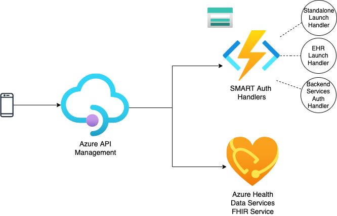

# Azure ONC (g)(10) & SMART on FHIR Sample

This sample demonstrates how Azure Health Data Services can be used to pass the Inferno test for ONC (g)(10) compliance, using Azure Active Directory as the identity provider. While the FHIR Server is the core of this sample, some custom code and routing is required to fully meet the requirements. This sample is therefore *not* using only the FHIR Server but other Azure Services to pass the Inferno tests.

## Components 

The following components are deployed with this sample. For more details of how the pieces work together, check out [the technical guide](./docs/technical-guide.md).

- FHIR Service
- Azure API Management
- Azure Function
- Azure Storage

## Status

This sample is still under active development.

### Completed

- Standalone Launch (Confidential Client)
- EHR Launch 
- Standalone Launch Public Client
- Bulk Data APIs

### To Do

- Connecting sample to FHIR Server (finishing scope work first)
- Proper exposing of scopes for FHIR in Azure Active Directory
- Limited Patient
- Auth for SMART Backend Services (RSA384)
- Documentation for loading US Core

## Prerequisites

- Azure CLI
  - Please install this via [the instructions here](https://learn.microsoft.com/en-us/cli/azure/install-azure-cli)
- Azure Developer CLI
  -  Please install this via [the instructions here](https://learn.microsoft.com/azure/developer/azure-developer-cli/install-azd?tabs=baremetal%2Cwindows).
- Azure Active Directory Configuration
  - One Application Registration representing the FHIR Service with the scopes as defined [here in the manifest](./docs/oauth2-permissions.json).
  - Application Registrations for each of the 

## Deploying to a new environment

1. Open a terminal to the same directory as this README.
2. Make sure to login to the correct tenant with the `az cli`. For example: `az login -t 12345678-90ab-cdef-1234-567890abcdef`.
3. Run `azd init` to create a new environment.
  - name: environment name from above
  - location: <your location>
  - subscription: <your-subscription>
4. Edit `infra/main.parameters.json` to add your base Application Registration Application ID as `smartAudience`.
5. Run `azd up` to deploy the Azure infrastructure and function app.

### Working with an active environment

- To change environments, run `azd env select`.
- If you need to change the Azure resources in your environment, change the bicep templates in `/infra` and run `azd provision`.
- To deploy the Function App to Azure, run `azd deploy`.
