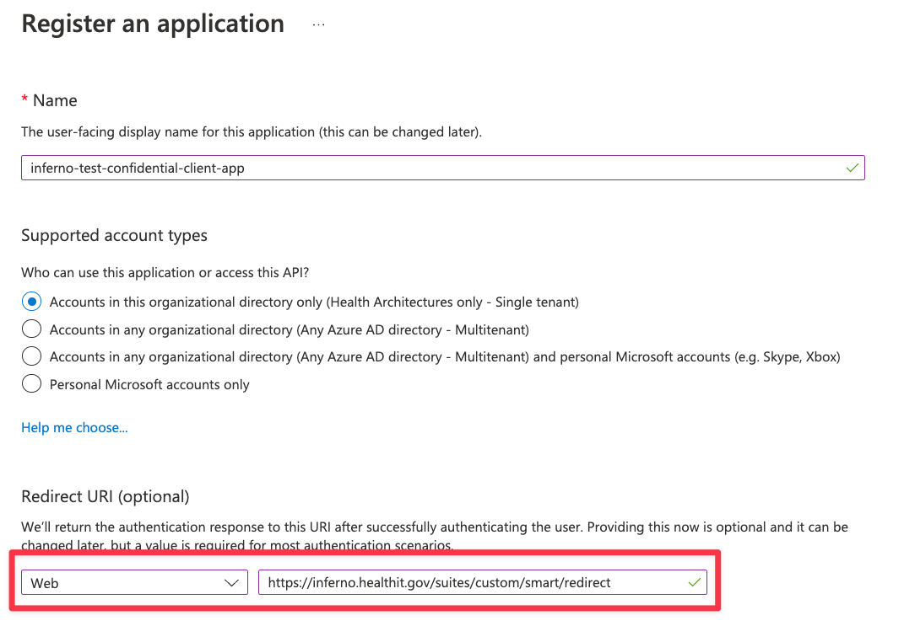

# Sample Deployment: Azure ONC (g)(10) & SMART on FHIR Sample

This document will guide you through the steps needed for deploying this sample. Since this sample is a combination of several Azure components and Azure Active Directory configuration, it is not all automated.

## 1. Prerequisites

Before deploying this sample, you will need to install some Azure tools **and** ensure you have the proper access to an Azure subscription / tenant.

- Make sure you have the pre-requisites applications installed on your computer.
  - Azure CLI: Please install this via [the instructions here](https://learn.microsoft.com/cli/azure/install-azure-cli)
  - Azure Developer CLI: Please install this via [the instructions here](https://learn.microsoft.com/azure/developer/azure-developer-cli/install-azd?tabs=baremetal%2Cwindows)
  - Visual Studio or Visual Studio Code (for debugging sample).
  - NPM (for debugging sample).
- .NET SDK installed (the version specified in [global.json](../../../global.json).)
- Access to an Azure Subscription where you can create resources and add role assignments.
- Elevated access in Azure Active Directory to create Application Registrations and grant Admin Consent.

## 2. Create Authorize User Input Application in Azure Active Directory

The Authorize User Input Application is needed to allow users to select which scopes they want to consent to for SMART on FHIR applications. Azure AD does not support session based scoping, so this app handles modifying consent records for the user.

1. Open Azure Active Directory and create a new Application Registration.
1. Choose Single-page application (SPA) for the redirict URI and add `http://localhost:3000` (useful for debugging).
1. After registering the application, Under `Token Configuration` add optional claim for Access token type. Select `login_hint` claim and click on Add. 
1. Under `Expose an API`
     * Set the Application ID URI in the default format (`api://<app-id>`).
     * Add a new scope with the value `user_impersonation` and click on 'Add Scope'.

## 3. Deploy Azure Resources

This sample uses the Azure Developer CLI for deployment. This allows for easy deployment of both infrastructure and code. 
Lets look at the configuration needed to deploying this sample :  

- Open `main.pramaters.json` inside of the `infra` folder and fill out the following parameters:
  - `apimPublisherName`: Sample owner name.
  - `apimPublisherEmail`: Sample owner email address.
  - `contextAadApplicationId`: Leave this blank for now.
- Open a terminal to this directory (`samples/smart`).
- Login with the Azure CLI. Specify the tenant if you have more than one.
  - `az login` or `az login -t <tenant-id>`.
- Run the `azd up` command from this directory. Enter 
  - Environment Name: Prefix for the resource group that will be created to hold all Azure resources ([see more details](https://learn.microsoft.com/azure/developer/azure-developer-cli/faq#what-is-an-environment-name)). You can always create a new environment with `azd env new`.
  - Azure Location: The Azure location where your resources will be deployed.
  - Azure Subscription: The Azure location where your resources will be deployed.
- *NOTE:* This will take about an hour to deploy, mainly for Azure API Management. You can continue with Azure Active Directory setup below.

## 4. Give Auth Azure Function Access to Modify Graph Data

As part of the scope selection flow, the Auth Azure Function will modify user permissions for the signed in user. This requires granting the Azure Managed Identity behind Azure Functions Application Administrator (or similar access).

1. Copy the Managed Identity for the Authorize Azure Function
1. Open Azure Active Directory
1. In "Roles and Administrators" open Application Administrator.
1. Add the Azure Function Managed Identity to this AAD role.

## 5. Set the redirect URL for your User Input Application in Azure Active Directory

Open the Application Registration from step 2. Under "Authentication", add the follow URI as SPA Redirect URIs.
- The base URL for your Azure Static WebApp deployed via AZD.

## 6. Create Test Application Registrations in Azure Active Directory

It's best practice to register an Application Registration in Azure AD for each client application that will need to access your FHIR Service. This will allow for granular control of data access per application for the tenant administrator and the users.

### Patient Standalone Confidential Client Application

The Patient Standalone Launch application is a standard confidential client application which leverages the SMART Scopes exposed by Azure Health Data Services.

- Create a new application in Azure Active Directory. Make sure to select `Web` as the platform and add the redirect URL for Inferno (`https://inferno.healthit.gov/suites/custom/smart/redirect`).
- In API Permissions for this new application, add the below:
  - Azure Healthcare APIs (Delegated)
    - fhirUser
    - launch
    - patient.AllergyIntolerance.read
    - patient.CarePlan.read
    - patient.CareTeam.read
    - patient.Condition.read
    - patient.Device.read
    - patient.DiagnosticReport.read
    - patient.DocumentReference.read
    - patient.Encounter.read
    - patient.Goal.read
    - patient.Immunization.read
    - patient.Location.read
    - patient.MedicationRequest.read
    - patient.Medication.read
    - patient.Observation.read
    - patient.Organization.read
    - patient.Patient.read
    - patient.Practitioner.read
    - patient.PractitionerRole.read
    - patient.Procedure.read
    - patient.Provenance.read
  - Microsoft Graph (Delegated)
    - openid
    - offline_access

- Generate a secret for this application. Save this and the client id for testing Inferno *1. Standalone Patient App*.

### EHR Launch Confidential Client Application

The EHR Launch application is a standard confidential client application which leverages the SMART Scopes exposed by Azure Health Data Services.

- Create a new application in Azure Active Directory. Make sure to select `Web` as the platform and add the redirect URL for Inferno (`https://inferno.healthit.gov/suites/custom/smart/redirect`).
- In API Permissions for this new application, add the below:
  - Azure Healthcare APIs (Delegated)
    - fhirUser
    - launch
    - patient.AllergyIntolerance.read
    - patient.CarePlan.read
    - patient.CareTeam.read
    - patient.Condition.read
    - patient.Device.read
    - patient.DiagnosticReport.read
    - patient.DocumentReference.read
    - patient.Encounter.read
    - patient.Goal.read
    - patient.Immunization.read
    - patient.Location.read
    - patient.MedicationRequest.read
    - patient.Medication.read
    - patient.Observation.read
    - patient.Organization.read
    - patient.Patient.read
    - patient.Practitioner.read
    - patient.PractitionerRole.read
    - patient.Procedure.read
    - patient.Provenance.read
  - Microsoft Graph (Delegated)
    - openid
    - offline_access

- Generate a secret for this application. Save this and the client id for testing Inferno *3. EHR Practitioner App*.

### Backend Service Client Application

Azure Active Directory does not support RSA384 and/or ES384 which is required by the SMART on FHIR implementation guide. In order to provide this capability, custom code is required to validate the JWT assertion and return a bearer token generated for the client with the corresponding client secret in an Azure KeyVault.

- Create a new application in Azure Active Directory. No platform or redirect URL is needed.
- Grant this application `FHIR Data Reader` and `FHIR Exporter` role in your FHIR Service. We only support `system/*.read` for now through the `FHIR Data Reader` role.
<!--- In API Permissions for this new application, add the below:
  - Azure Healthcare APIs (Application)
    - system.all.read
- Grant admin consent for your Application on the API Permission page-->
- Generate a secret for this application. Save this and the client id.
- In the resource group that matches your environment, open the KeyVault with the suffix `backkv`.
- Add a new secret that corresponds to the Application you just generated. 
  - Name: Application ID/Client ID of the application
  - Secret: The secret you generated for the application
  - Tags: Make sure to add the tag `jwks_url` with the backend service JWKS URL. For Inferno testing, this is: https://inferno.healthit.gov/suites/custom/g10_certification/.well-known/jwks.json

- Save the client id for later testing.

## 7. Add sample data

See [this script](../scripts/Load-ProfilesData.ps1).

## TODO

- Finish context app section.
- Add public client app.
- Add more info to add sample data. Link to generated data.
- Talk about Need Patient Banner / SMART Style URL. This needs to be changed in APIM policy.
