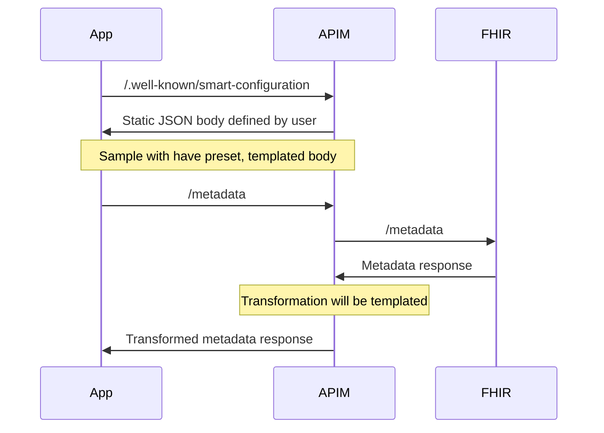
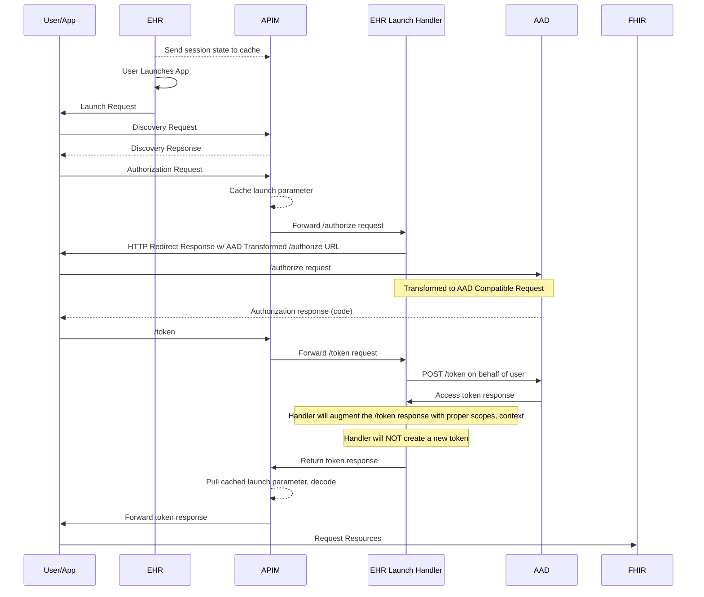
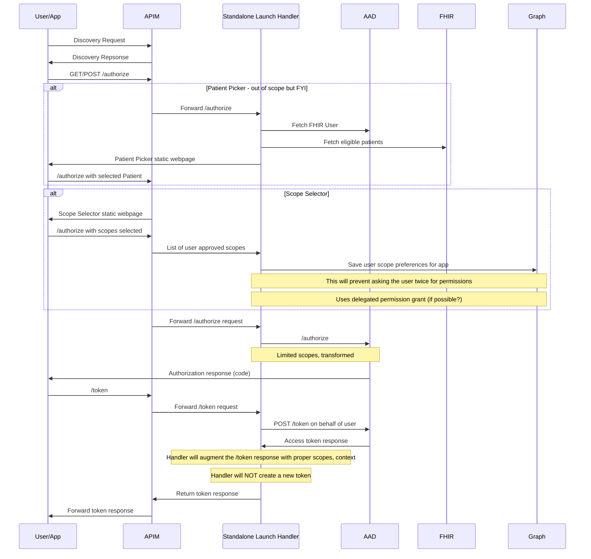
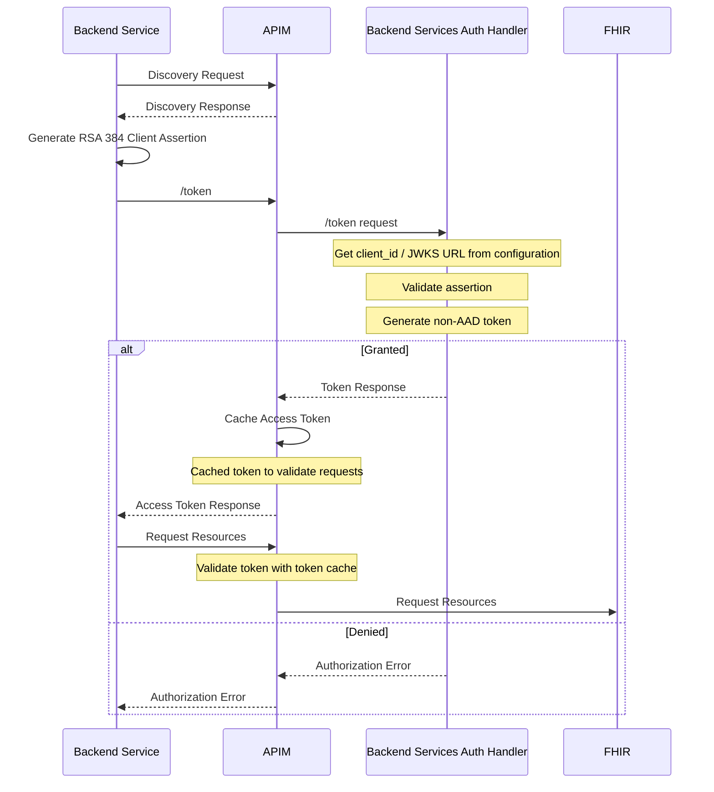

# Azure ONC (g)(10) Sample Technical Guide

This document describes how we plan to create a passing ONC (g)(10) sample combining Azure Health Data Services with other Azure services.

## Introduction

ONC (g)(10) is a requirement of EHR vendors laid out by the Office of the National Coordinator. The full name for this requirement is Standardized API for Patient and Population Services criterion § 170.315(g)(10) in the 2015 Edition Cures Update.

## Architecture Overview

To successfully use this ONC (g)(10) sample, your Azure environment must be setup with the below resources.

- Azure Health Data Services with a FHIR Service
- Azure API Management
- Azure Function
  - Needed for certain SMART operations not supported by the FHIR Service or specific to your EHR.
    - Standalone Launch Handler enables the auth flow for standalone launch scenarios.
    - EHR Launch Handler enables the auth flow for EHR launch scenarios.
    - Backend Services Auth Handler enables the auth flow for SMART backend services scenarios.
- Storage Account
  - Needed for Azure Function, assorted static assets, and configuration tables.

## Conformance/Discovery

Conformance for SMART apps allows application developers to target many different EHRs in a unified way. Discovery is the method of which applications know how to interact with a specific EHR. See the [SMART implementation guide](https://www.hl7.org/fhir/smart-app-launch/conformance.html) for more details. There are two different discovery endpoints for SMART on FHIR servers:

- The capability statement (`/metadata`) which holds information about the entire FHIR server.
- The SMART on FHIR Well-Known endpoint (`/.well-known/smart-configuration`) which holds SMART on FHIR specific configuration.

Azure Health Data Services needs some modification to the capability statement and the addition of the SMART on FHIR Well-Known endpoint. We can easily meet both of these with a couple of API Management policy.

- Capability statement policy to transform the conformance statement using a `setBody` policy.
  - Adds our authorize and token Azure Function endpoints so clients know where to authenticate.
  - Change the conformance so signify that we can handle SMART on FHIR clients.
- SMART on FHIR Well-Known policy to return a static string for our SMART on FHIR configuration.

**NOTE:** This will result in a separate conformance statement for clients accessing via API Management versus directly through the FHIR Service since this sample is adding additional capabilities to Azure Health Data Services.

## EHR Launch

## Standalone Launch

SMART standalone launch refers to when an app launches from outside an EHR session. Generally these are patient facing apps since patients often do not access an EHR to view their data (patients could have EHR launch apps from an EHR patient portal). This flow often relies on user input for establishing the correct context for the SMART application since there is no session data to pull from. There are two potential scenarios where an EHR application may need to gather input from the user:

- Selecting a record (like a patient) when a user has access to mulitple patients (like parent/child relatonship)
- Reviewing and granting limited scopes to an application to control how much of the patient's data the SMART app can access

*I think (need to verify)* ONC (g)(10) does not require a patient picker, so it is out of scope for this sample. If we need it, it's not too bad.

Azure Active Directory does not have a mechanism for selecting a subset of scopes when approving/denying an application. Due to this, we have to serve a custom scope selection interface for standalone launch scenarios.

  
Click to view standalone launch mappings to Inferno tests

  - Goal of this is to pass Inferno Sections 1 and 2
    - This also includes Inferno 9.1
  - 1.1 will be handled by Conformance/Discovery
  - 1.3 is handled by changes to the OAuth endpoints
    - 1.3.08 must include the openid scope
    - 1.3.10 is context based
      - Using fhirUser scope (which also much be a claim in the access token)
  - 1.5 tests Azure AD’s openid scope and related artifacts in detail
  - 1.6 tests Azure AD’s token refresh
  - 1.7 need US Core loaded, test resources loaded
  - 2.1 needs a way for users to select limited scopes from those the app is asking for
    - this will be tricky - may need a UI or some special API
  - 2.3 confirms that resources are returned correctly

 

### Overall Standalone Launch Client Flow

[Link to digram in editor](https://mermaid.live/edit#pako:eNqlVk2P2kAM_StWTrsSK-45bIXEsotEuwjooRKXYeKQEcnMdGYC3a72v9czQ_imzdKcwLGf7ednw3vCVYZJmlj8WaPk2BdsaVg1l0CPZsYJLjSTDr5bNN2e1udveuPh13Pr1DGZsVJJhBGrJS_ghQwlmgsAvf65cfAynJxbnw3TRTQ3BcHD42OoIYW-sFyt0bzBxLdjXfT0L4NXE3Lsqa2SFq-CPj_NuuPX6Qy6rHaFMuL31peVDsbMCaS6xoKv0MADqNqByoHQNcKCvgx-DKP7USVX2UlhoMyGmewsnX-uhsV6e30KR0dmz15opm2sD2iCsRRLsSiRmA_d2bYge35PeLGOvnPY4EKz5UE_F-jetw0b4QqwWCJ3mDWQMRhlth_CNJA9DY7KXGB7X9ex63_V5ZHsrrzPzXgkbJBJTXmAaW1Ii9kWsi3ZYRWoI7bGiBM1pw3maPwqW8hVQN8jSuUQvO6vY3ca4FkhLLValh5y7YfJ7ErIJbhim9BtBMeQRKOphLWCFum2ZES4hYy4XDI_6z0e0DWi1HciB63IQrL8cn-ggZMN_9RegYlXwiNEnBb7dbqWrboMkSNRCbcbcwccdWaJvapRD3mdyLW3zUUqJSoMWu1PFdz5o31_9WJ1nVrhLcyEuIaV1ozE4xhjqcoFFqzMG3Ufd_aXInqcFGuhKSF22pridFdWUCyrl5VXrJdq9xgybi9tnG5WhkbBlXT4y92a7tvrDLhBki4wkLiBgwH8g8AwsAm62siLvV-4Yc24jt2TTlLR1jCR0a_5uw-eJ9R-hfMkpY8Z5qwu3TyZyw9yrXVG1T5lgq5gkuastNhJSNlq-iZ5kjpTY-O0_Uew9fr4A5X_uqE)

## Backend Service Authorization

Backend Service Authorization is part of the [FHIR Bulk Data Access Implementation Guide](https://hl7.org/fhir/uv/bulkdata/STU1.0.1/authorization/index.html). Backend services are intended to be used by developers of backend services (clients) that autonomously (or semi-autonomously) need to access resources from FHIR servers that have pre-authorized defined scopes of access. It is a combination of a client registration process (using JSON Web Keys), token generation without the sharing of secrets, and using SMART on FHIR with `system` scopes to access data.

SMART Backend Services requires that FHIR servers allow client asymmetric authentication with RSA384 and/or ES384. Active Directory does not support this natively today, so the backend service handler in the SMART auth handlers function is responsible for validating the backend service authentication request, creating a token, and returning the token to Azure API Management for use with future client requests. Azure API Management will cache the token for the life fo the token and check that any backend service request tokens match entries in the cache.

### Backend Service Registration

Client registration is an out-of-band process required before backend services can access data from the FHIR server. Client registration can be an automated or manual process. In our sample, we have a manual client registration process leveraging a table in the Azure Storage service.

- Collect the JWKS url from the client who needs to register.
- Generate a `client_id` for the client who needs to register.
- Store the `client_id` and JWKS url in the Azure Table Storage table created in the sample deployment.

### Backend Service Authorization Flow

## Resources

- [SMART on FHIR 1.0 Implementation Guide](https://hl7.org/fhir/smart-app-launch/1.0.0/)
- [FHIR Bulk Data Access Implementation Guide (STU1.0.1)](https://hl7.org/fhir/uv/bulkdata/STU1.0.1/)
- [ONC Health IT Certification Program API Resource Guide](https://onc-healthit.github.io/api-resource-guide/g10-criterion/)
- [Inferno Testing Tool](https://inferno.healthit.gov/)
- [ONC Certification (g)(10) Standardized API Test Kit on Github](https://github.com/onc-healthit/onc-certification-g10-test-kit)

# TODO

- EHR Launch
- Rewriting of resource URLs
- Missing Data