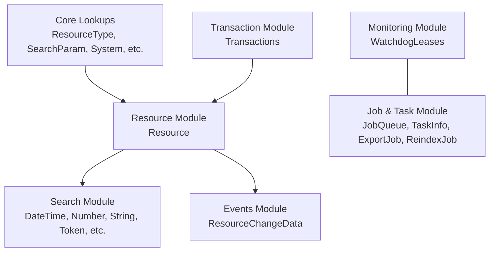
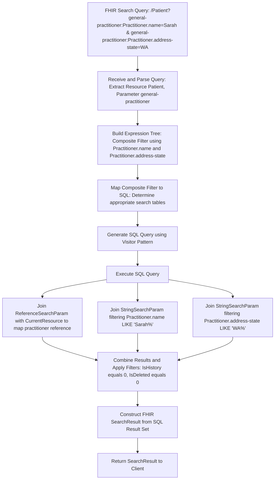

# Schema design concepts

## Overview


## Schema details
```mermaid
erDiagram
    %% ==============================
    %% Core Lookup Tables
    %% ==============================
    CLAIM_TYPE {
      tinyint ClaimTypeId "IDENTITY, UNIQUE (UQ_ClaimType_ClaimTypeId)"
      varchar Name "PK, DATA_COMPRESSION=PAGE, Collation: Latin1_General_100_CS_AS"
    }
    COMPARTMENT_TYPE {
      tinyint CompartmentTypeId "IDENTITY, UNIQUE (UQ_CompartmentType_CompartmentTypeId)"
      varchar Name "PK, DATA_COMPRESSION=PAGE, Collation: Latin1_General_100_CS_AS"
    }
    QUANTITY_CODE {
      int QuantityCodeId "IDENTITY, UNIQUE (UQ_QuantityCode_QuantityCodeId)"
      nvarchar Value "PK, DATA_COMPRESSION=PAGE, Collation: Latin1_General_100_CS_AS"
    }
    RESOURCE_CHANGE_TYPE {
      tinyint ResourceChangeTypeId "PK"
      nvarchar Name "Unique, length=50"
    }
    RESOURCE_TYPE {
      smallint ResourceTypeId "IDENTITY, UNIQUE (UQ_ResourceType_ResourceTypeId)"
      nvarchar Name "PK, DATA_COMPRESSION=PAGE, Collation: Latin1_General_100_CS_AS"
    }
    SEARCH_PARAM {
      smallint SearchParamId "IDENTITY, UNIQUE (UQ_SearchParam_SearchParamId)"
      varchar Uri "PK, DATA_COMPRESSION=PAGE, Collation: Latin1_General_100_CS_AS"
      varchar Status "length=20"
      datetimeoffset LastUpdated
      bit IsPartiallySupported
    }
    SYSTEM {
      int SystemId "IDENTITY, UNIQUE (UQ_System_SystemId)"
      nvarchar Value "PK, DATA_COMPRESSION=PAGE"
    }
    
    %% ==============================
    %% Resource & Change Tables
    %% ==============================
    RESOURCE {
      smallint ResourceTypeId "PK part, PartitionScheme_ResourceTypeId"
      varchar ResourceId "PK, Collation: Latin1_General_100_CS_AS"
      int Version "NOT NULL"
      bit IsHistory "NOT NULL"
      bigint ResourceSurrogateId "PK part"
      bit IsDeleted "NOT NULL"
      varchar RequestMethod "length=10"
      varbinary RawResource "NOT NULL, CHECK (RawResource > 0x0)"
      bit IsRawResourceMetaSet "DEFAULT 0"
      varchar SearchParamHash "length=64"
      bigint TransactionId
      bigint HistoryTransactionId
    }
    RESOURCE_WRITE_CLAIM {
      bigint ResourceSurrogateId "NOT NULL"
      tinyint ClaimTypeId "NOT NULL"
      nvarchar ClaimValue "NOT NULL, length=128"
    }
    RESOURCE_CHANGE_DATA {
      bigint Id "IDENTITY"
      datetime2 Timestamp "DEFAULT sysutcdatetime(), Partitioned on PartitionScheme_ResourceChangeData_Timestamp"
      varchar ResourceId "length=64"
      smallint ResourceTypeId
      int ResourceVersion
      tinyint ResourceChangeTypeId "NOT NULL"
    }
    RESOURCE_CHANGE_DATA_STAGING {
      bigint Id "IDENTITY"
      datetime2 Timestamp "DEFAULT sysutcdatetime()"
      varchar ResourceId "length=64"
      smallint ResourceTypeId
      int ResourceVersion
      tinyint ResourceChangeTypeId
    }
    
    %% ==============================
    %% Job & Task Related Tables
    %% ==============================
      EXPORT_JOB {
        varchar Id "PK, Collation: Latin1_General_100_CS_AS"
        varchar Hash "Collation: Latin1_General_100_CS_AS"
        varchar Status "length=10"
        datetime2 HeartbeatDateTime
        varchar RawJobRecord "varchar(max)"
        rowversion JobVersion
      }
      REINDEX_JOB {
        varchar Id "PK, Collation: Latin1_General_100_CS_AS"
        varchar Status "length=10"
        datetime2 HeartbeatDateTime
        varchar RawJobRecord "varchar(max)"
        rowversion JobVersion
      }
      JOB_QUEUE {
        tinyint QueueType "PK part, Partition key on TinyintPartitionScheme(QueueType)"
        bigint GroupId "NOT NULL"
        bigint JobId "PK part"
        tinyint PartitionId "Computed: convert(tinyint, JobId % 16)"
        varchar Definition "varchar(max)"
        varbinary(20) DefinitionHash
        bigint Version "DEFAULT datediff_big(millisecond,'0001-01-01',getUTCdate())"
        tinyint Status "DEFAULT 0"
        tinyint Priority "DEFAULT 100"
        bigint Data
        varchar Result "varchar(max)"
        datetime CreateDate "DEFAULT getUTCdate()"
        datetime StartDate
        datetime EndDate
        datetime HeartbeatDate "DEFAULT getUTCdate()"
        varchar Worker "length=100"
        varchar Info "length=1000"
        bit CancelRequested "DEFAULT 0"
      }
      TASK_INFO {
        varchar TaskId "PK, length=64"
        varchar QueueId "length=64"
        smallint Status "NOT NULL"
        smallint TaskTypeId "NOT NULL"
        varchar RunId "length=50, NULL"
        bit IsCanceled "NOT NULL"
        smallint RetryCount "NOT NULL"
        smallint MaxRetryCount "NOT NULL"
        datetime2 HeartbeatDateTime
        varchar InputData "varchar(max) NOT NULL"
        varchar TaskContext "varchar(max) NULL"
        varchar Result "varchar(max) NULL"
        datetime2 CreateDateTime "NOT NULL, DEFAULT SYSUTCDATETIME()"
        datetime2 StartDateTime "NULL"
        datetime2 EndDateTime "NULL"
        varchar Worker "length=100, NULL"
        varchar RestartInfo "varchar(max) NULL"
        varchar ParentTaskId "length=64, NULL"
      }
    
    %% ==============================
    %% Search Parameter Tables
    %% ==============================
    DATE_TIME_SEARCH_PARAM {
    smallint ResourceTypeId "PK part, PartitionScheme_ResourceTypeId"
    bigint ResourceSurrogateId "PK part, PartitionScheme_ResourceTypeId"
    smallint SearchParamId "PK part"
    datetime2 StartDateTime "NOT NULL"
    datetime2 EndDateTime "NOT NULL"
    bit IsLongerThanADay "NOT NULL"
    bit IsMin "DEFAULT 0"
    bit IsMax "DEFAULT 0"
    }
    NUMBER_SEARCH_PARAM {
    smallint ResourceTypeId "PK part, PartitionScheme_ResourceTypeId"
    bigint ResourceSurrogateId "PK part, PartitionScheme_ResourceTypeId"
    smallint SearchParamId "PK part"
    decimal SingleValue "decimal(36,18), NULL"
    decimal LowValue "decimal(36,18) NOT NULL"
    decimal HighValue "decimal(36,18) NOT NULL"
    }
    QUANTITY_SEARCH_PARAM {
    smallint ResourceTypeId "PK part, PartitionScheme_ResourceTypeId"
    bigint ResourceSurrogateId "PK part, PartitionScheme_ResourceTypeId"
    smallint SearchParamId "PK part"
    int SystemId "NULL"
    int QuantityCodeId "NULL"
    decimal SingleValue "decimal(36,18), NULL"
    decimal LowValue "decimal(36,18) NOT NULL"
    decimal HighValue "decimal(36,18) NOT NULL"
    }
    REFERENCE_SEARCH_PARAM {
    smallint ResourceTypeId "PK part, PartitionScheme_ResourceTypeId"
    bigint ResourceSurrogateId "PK part, PartitionScheme_ResourceTypeId"
    smallint SearchParamId "PK part"
    varchar BaseUri "varchar(128), Collation: Latin1_General_100_CS_AS, NULL"
    smallint ReferenceResourceTypeId "NULL"
    varchar ReferenceResourceId "varchar(64), Collation: Latin1_General_100_CS_AS"
    int ReferenceResourceVersion "NULL"
    }
    REFERENCE_TOKEN_COMPOSITE_SEARCH_PARAM {
    smallint ResourceTypeId "PK part, PartitionScheme_ResourceTypeId"
    bigint ResourceSurrogateId "PK part, PartitionScheme_ResourceTypeId"
    smallint SearchParamId "PK part"
    varchar BaseUri1 "varchar(128), Collation: Latin1_General_100_CS_AS, NULL"
    smallint ReferenceResourceTypeId1 "NULL"
    varchar ReferenceResourceId1 "varchar(64), Collation: Latin1_General_100_CS_AS"
    int ReferenceResourceVersion1 "NULL"
    int SystemId2 "NULL"
    varchar Code2 "varchar(256), Collation: Latin1_General_100_CS_AS"
    varchar CodeOverflow2 "varchar(max), Collation: Latin1_General_100_CS_AS, NULL"
    }
    STRING_SEARCH_PARAM {
    smallint ResourceTypeId "NOT NULL, PK part, PartitionScheme_ResourceTypeId"
    bigint ResourceSurrogateId "NOT NULL, PK part, PartitionScheme_ResourceTypeId"
    smallint SearchParamId "NOT NULL, PK part"
    nvarchar Text "nvarchar(256), NOT NULL, Collation: Latin1_General_100_CI_AI_SC"
    nvarchar TextOverflow "nvarchar(max), NULL, Collation: Latin1_General_100_CI_AI_SC"
    bit IsMin "NOT NULL, DEFAULT 0"
    bit IsMax "NOT NULL, DEFAULT 0"
    }
    TOKEN_DATE_TIME_COMPOSITE_SEARCH_PARAM {
    smallint ResourceTypeId "NOT NULL, PK part, PartitionScheme_ResourceTypeId"
    bigint ResourceSurrogateId "NOT NULL, PK part, PartitionScheme_ResourceTypeId"
    smallint SearchParamId "NOT NULL, PK part"
    int SystemId1 "NULL"
    varchar Code1 "varchar(256), NOT NULL, Collation: Latin1_General_100_CS_AS"
    datetime2 StartDateTime2 "NOT NULL"
    datetime2 EndDateTime2 "NOT NULL"
    bit IsLongerThanADay2 "NOT NULL"
    varchar CodeOverflow1 "varchar(max), NULL, Collation: Latin1_General_100_CS_AS"
    }
    TOKEN_NUMBER_NUMBER_COMPOSITE_SEARCH_PARAM {
    smallint ResourceTypeId "NOT NULL, PK part, PartitionScheme_ResourceTypeId"
    bigint ResourceSurrogateId "NOT NULL, PK part, PartitionScheme_ResourceTypeId"
    smallint SearchParamId "NOT NULL, PK part"
    int SystemId1 "NULL"
    varchar Code1 "varchar(256), NOT NULL, Collation: Latin1_General_100_CS_AS"
    decimal SingleValue2 "decimal(36,18), NULL"
    decimal LowValue2 "decimal(36,18), NULL"
    decimal HighValue2 "decimal(36,18), NULL"
    decimal SingleValue3 "decimal(36,18), NULL"
    decimal LowValue3 "decimal(36,18), NULL"
    decimal HighValue3 "decimal(36,18), NULL"
    bit HasRange "NOT NULL"
    varchar CodeOverflow1 "varchar(max), NULL, Collation: Latin1_General_100_CS_AS"
    }
    TOKEN_QUANTITY_COMPOSITE_SEARCH_PARAM {
    smallint ResourceTypeId "NOT NULL, PK part, PartitionScheme_ResourceTypeId"
    bigint ResourceSurrogateId "NOT NULL, PK part, PartitionScheme_ResourceTypeId"
    smallint SearchParamId "NOT NULL, PK part"
    int SystemId1 "NULL"
    varchar Code1 "varchar(256), NOT NULL, Collation: Latin1_General_100_CS_AS"
    int SystemId2 "NULL"
    int QuantityCodeId2 "NULL"
    decimal SingleValue2 "decimal(36,18), NULL"
    decimal LowValue2 "decimal(36,18), NULL"
    decimal HighValue2 "decimal(36,18), NULL"
    varchar CodeOverflow1 "varchar(max), NULL, Collation: Latin1_General_100_CS_AS"
    }
    TOKEN_SEARCH_PARAM {
    smallint ResourceTypeId "NOT NULL, PK part, PartitionScheme_ResourceTypeId"
    bigint ResourceSurrogateId "NOT NULL, PK part, PartitionScheme_ResourceTypeId"
    smallint SearchParamId "NOT NULL, PK part"
    int SystemId "NULL"
    varchar Code "varchar(256), NOT NULL, Collation: Latin1_General_100_CS_AS"
    varchar CodeOverflow "varchar(max), NULL, Collation: Latin1_General_100_CS_AS"
    }
    TOKEN_STRING_COMPOSITE_SEARCH_PARAM {
    smallint ResourceTypeId "NOT NULL, PK part, PartitionScheme_ResourceTypeId"
    bigint ResourceSurrogateId "NOT NULL, PK part, PartitionScheme_ResourceTypeId"
    smallint SearchParamId "NOT NULL, PK part"
    int SystemId1 "NULL"
    varchar Code1 "varchar(256), NOT NULL, Collation: Latin1_General_100_CS_AS"
    nvarchar Text2 "nvarchar(256), NOT NULL, Collation: Latin1_General_CI_AI"
    nvarchar TextOverflow2 "nvarchar(max), NULL, Collation: Latin1_General_CI_AI"
    varchar CodeOverflow1 "varchar(max), NULL, Collation: Latin1_General_100_CS_AS"
    }
    TOKEN_TEXT {
    smallint ResourceTypeId "NOT NULL, PK part, PartitionScheme_ResourceTypeId"
    bigint ResourceSurrogateId "NOT NULL, PK part, PartitionScheme_ResourceTypeId"
    smallint SearchParamId "NOT NULL, PK part"
    nvarchar Text "nvarchar(400), NOT NULL, Collation: Latin1_General_CI_AI"
    bit IsHistory "NOT NULL, DEFAULT 0"
    }
    TOKEN_TOKEN_COMPOSITE_SEARCH_PARAM {
    smallint ResourceTypeId "NOT NULL, PK part, PartitionScheme_ResourceTypeId"
    bigint ResourceSurrogateId "NOT NULL, PK part, PartitionScheme_ResourceTypeId"
    smallint SearchParamId "NOT NULL, PK part"
    int SystemId1 "NULL"
    varchar Code1 "varchar(256), NOT NULL, Collation: Latin1_General_100_CS_AS"
    int SystemId2 "NULL"
    varchar Code2 "varchar(256), NOT NULL, Collation: Latin1_General_100_CS_AS"
    varchar CodeOverflow1 "varchar(max), NULL, Collation: Latin1_General_100_CS_AS"
    varchar CodeOverflow2 "varchar(max), NULL, Collation: Latin1_General_100_CS_AS"
    }
    URI_SEARCH_PARAM {
    smallint ResourceTypeId "NOT NULL, PK part, PartitionScheme_ResourceTypeId"
    bigint ResourceSurrogateId "NOT NULL, PK part, PartitionScheme_ResourceTypeId"
    smallint SearchParamId "NOT NULL, PK part"
    varchar Uri "varchar(256), NOT NULL, Collation: Latin1_General_100_CS_AS"
    }

    %% ==============================
    %% Transaction & URI Tables
    %% ==============================
    TRANSACTIONS {
      bigint SurrogateIdRangeFirstValue "PK"
      bigint SurrogateIdRangeLastValue "NOT NULL"
      varchar Definition "length=2000, NULL"
      bit IsCompleted "NOT NULL, DEFAULT 0"
      bit IsSuccess "NOT NULL, DEFAULT 0"
      bit IsVisible "NOT NULL, DEFAULT 0"
      bit IsHistoryMoved "NOT NULL, DEFAULT 0"
      datetime CreateDate "NOT NULL, DEFAULT getUTCdate()"
      datetime EndDate "NULL"
      datetime VisibleDate "NULL"
      datetime HistoryMovedDate "NULL"
      datetime HeartbeatDate "NOT NULL, DEFAULT getUTCdate()"
      varchar FailureReason "varchar(max), NULL"
      bit IsControlledByClient "NOT NULL, DEFAULT 1"
      datetime InvisibleHistoryRemovedDate "NULL"
    }
    %%URI_SEARCH_PARAM ---|> TRANSACTIONS : "Logical Reference (via Resource)"
    
    %% ==============================
    %% Watchdog & Lease Table
    %% ==============================
    WATCHDOG_LEASES {
      varchar Watchdog "PK, length=100"
      varchar LeaseHolder "DEFAULT ''"
      datetime LeaseEndTime "NOT NULL, DEFAULT 0"
      varchar LeaseRequestor "DEFAULT ''"
      datetime LeaseRequestTime "NOT NULL, DEFAULT 0"
    }
    
    %% ==============================
    %% Logical Relationships
    %% ==============================
    COMPARTMENT_TYPE ||--o{ COMPARTMENT_ASSIGNMENT : "FK: CompartmentTypeId"
    QUANTITY_CODE ||--o{ QUANTITY_SEARCH_PARAM : "FK: QuantityCodeId"
    
    %% Search Parameter relationships
    SEARCH_PARAM ||--o{ DATE_TIME_SEARCH_PARAM : "FK: SearchParamId"
    SEARCH_PARAM ||--o{ NUMBER_SEARCH_PARAM : "FK: SearchParamId"
    SEARCH_PARAM ||--o{ QUANTITY_SEARCH_PARAM : "FK: SearchParamId"
    SEARCH_PARAM ||--o{ REFERENCE_SEARCH_PARAM : "FK: SearchParamId"
    SEARCH_PARAM ||--o{ REFERENCE_TOKEN_COMPOSITE_SEARCH_PARAM : "FK: SearchParamId"
    SEARCH_PARAM ||--o{ STRING_SEARCH_PARAM : "FK: SearchParamId"
    SEARCH_PARAM ||--o{ TOKEN_DATE_TIME_COMPOSITE_SEARCH_PARAM : "FK: SearchParamId"
    SEARCH_PARAM ||--o{ TOKEN_NUMBER_NUMBER_COMPOSITE_SEARCH_PARAM : "FK: SearchParamId"
    SEARCH_PARAM ||--o{ TOKEN_QUANTITY_COMPOSITE_SEARCH_PARAM : "FK: SearchParamId"
    SEARCH_PARAM ||--o{ TOKEN_SEARCH_PARAM : "FK: SearchParamId"
    SEARCH_PARAM ||--o{ TOKEN_STRING_COMPOSITE_SEARCH_PARAM : "FK: SearchParamId"
    SEARCH_PARAM ||--o{ TOKEN_TEXT : "FK: SearchParamId"
    SEARCH_PARAM ||--o{ TOKEN_TOKEN_COMPOSITE_SEARCH_PARAM : "FK: SearchParamId"
    SEARCH_PARAM ||--o{ URI_SEARCH_PARAM : "FK: SearchParamId"
    
    %% Link RESOURCE to its search parameters (logical relationship via ResourceTypeId & ResourceSurrogateId)
    RESOURCE ||--o{ DATE_TIME_SEARCH_PARAM : "Resource FK"
    RESOURCE ||--o{ NUMBER_SEARCH_PARAM : "Resource FK"
    RESOURCE ||--o{ QUANTITY_SEARCH_PARAM : "Resource FK"
    RESOURCE ||--o{ REFERENCE_SEARCH_PARAM : "Resource FK"
    RESOURCE ||--o{ REFERENCE_TOKEN_COMPOSITE_SEARCH_PARAM : "Resource FK"
    RESOURCE ||--o{ STRING_SEARCH_PARAM : "Resource FK"
    RESOURCE ||--o{ TOKEN_DATE_TIME_COMPOSITE_SEARCH_PARAM : "Resource FK"
    RESOURCE ||--o{ TOKEN_NUMBER_NUMBER_COMPOSITE_SEARCH_PARAM : "Resource FK"
    RESOURCE ||--o{ TOKEN_QUANTITY_COMPOSITE_SEARCH_PARAM : "Resource FK"
    RESOURCE ||--o{ TOKEN_SEARCH_PARAM : "Resource FK"
    RESOURCE ||--o{ TOKEN_STRING_COMPOSITE_SEARCH_PARAM : "Resource FK"
    RESOURCE ||--o{ TOKEN_TEXT : "Resource FK"
    RESOURCE ||--o{ TOKEN_TOKEN_COMPOSITE_SEARCH_PARAM : "Resource FK"
    RESOURCE ||--o{ URI_SEARCH_PARAM : "Resource FK"
    
    %% Transactions referenced by RESOURCE (via TransactionId / HistoryTransactionId)
    TRANSACTIONS ||--o{ RESOURCE : "Referenced by TransactionId / HistoryTransactionId"
    
    %% JOB & TASK relationship (logical via QueueId)
    JOB_QUEUE ||--o{ TASK_INFO : "QueueId (logical mapping)"
    
    %% Additional relationships for change data and write claim
    RESOURCE ||--o{ RESOURCE_CHANGE_DATA : "FK: (ResourceTypeId, ResourceId, Version)"
    RESOURCE ||--o{ RESOURCE_CHANGE_DATA_STAGING : "FK: (ResourceTypeId, ResourceId, Version)"
    RESOURCE ||--o{ RESOURCE_WRITE_CLAIM : "FK: ResourceSurrogateId"
    
    %% Lookup table relationships
    CLAIM_TYPE ||--o{ RESOURCE_WRITE_CLAIM : "FK: ClaimTypeId"
    RESOURCE_CHANGE_TYPE ||--o{ RESOURCE_CHANGE_DATA : "FK: ResourceChangeTypeId"
    RESOURCE_CHANGE_TYPE ||--o{ RESOURCE_CHANGE_DATA_STAGING : "FK: ResourceChangeTypeId"
    RESOURCE_TYPE ||--o{ RESOURCE : "FK: ResourceTypeId"

```

## Search example
