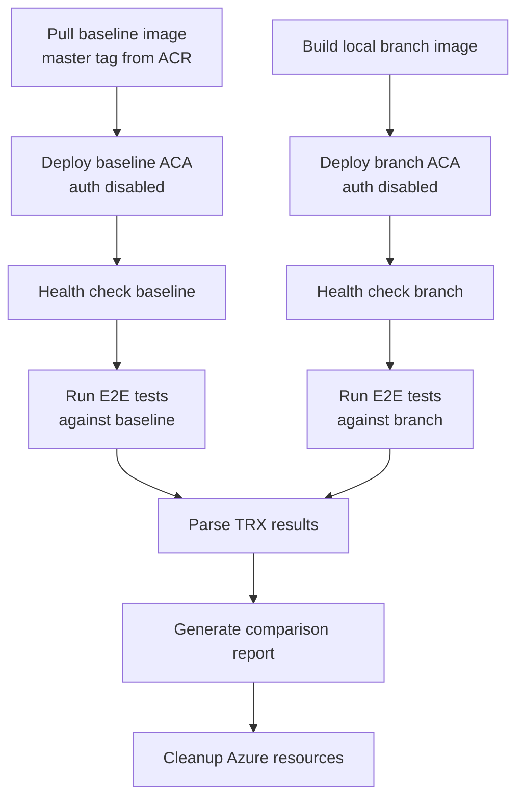

# A/B E2E Test Runner

Runs E2E tests against two FHIR server instances side-by-side:
- **Baseline**: The latest `master`-tagged Docker image from CI (the most recent passing main branch build).
- **Branch**: A freshly-built Docker image from your current local branch.

Both services are deployed as Azure Container Apps with **authorization disabled** for simplicity. The tool then runs the E2E test suite against both endpoints, collects `.trx` results, and produces a comparison report highlighting:
1. **Failures unique to one service** (most critical)
2. **Latency differences** (next most important)
3. **Overall pass/fail summary**

## Prerequisites

- Azure CLI (`az`) installed and authenticated
- Docker CLI with buildx support
- .NET SDK (matching `global.json`)
- Access to the `healthplatformregistry.azurecr.io` container registry
- An Azure subscription with permissions to create resource groups and Container Apps
- Docker Desktop or Docker Engine running locally (for building the branch image)
- User Access Administrator permissions on the subscription

## Usage

```powershell
# From the repository root:
./tools/ABTestRunner/Invoke-ABTest.ps1 `
    -FhirVersion R4 `
    -DataStore SqlServer `
    -Subscription "your-subscription-name-or-id" `
    -ResourceGroupPrefix "abtest" `
    -Location "westus2"
```

### Parameters

| Parameter | Required | Default | Description |
|-----------|----------|---------|-------------|
| `-FhirVersion` | No | `R4` | FHIR version: `Stu3`, `R4`, `R4B`, or `R5` |
| `-DataStore` | No | `SqlServer` | Backend: `SqlServer` or `CosmosDb` |
| `-Subscription` | Yes | — | Azure subscription name or ID |
| `-Location` | No | `westus2` | Azure region for resources |
| `-ResourceGroupName` | No | auto-generated | Override the resource group name |
| `-ContainerRegistry` | No | `healthplatformregistry.azurecr.io` | ACR for baseline image |
| `-BaselineTag` | No | `master` | Docker tag for the baseline image |
| `-CategoryFilter` | No | `''` | xUnit test category filter |
| `-SkipCleanup` | No | `$false` | Keep Azure resources after run |
| `-TestDllPath` | No | auto-built | Path to pre-built E2E test DLL |

## Output

Results are written to `./ab-test-results/<timestamp>` containing:
- `baseline.trx` — Raw test results for the baseline service
- `branch.trx` — Raw test results for the branch service
- `comparison-report.md` — Human-readable comparison highlighting differences
- `detailed-results.csv` — CSV with per-test latency and pass/fail data

## How It Works


