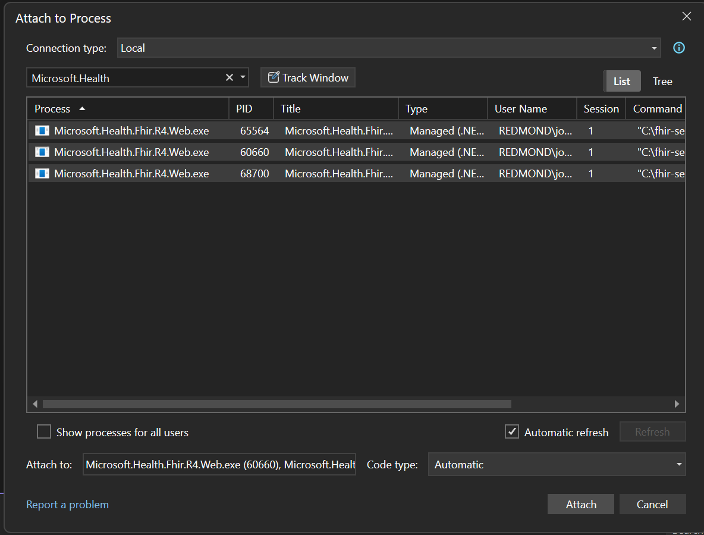

# Multi-instance local runner (NGINX proxy)

Use `start-local-fhir-nginx.ps1` to spin up multiple local FHIR R4 instances behind an NGINX reverse proxy on a single port. Default settings start three instances on ports 5001-5003 and expose them via http://localhost:4343.

## Prerequisites
- PowerShell 7+
- .NET SDK matching `global.json`
- `sqlcmd` available on PATH (for optional DB creation)
- Local SQL Server instance reachable by the provided connection string

## Quick start
```pwsh
pwsh ./Tools/MultiInstanceRunner/start-local-fhir-nginx.ps1 -PersistTestEnvironment
```
This builds the R4 project (unless `-SkipBuild`), ensures the DB exists (unless `-SkipSchemaInitialization`), starts NGINX, and launches the configured number of instances.

## Key parameters
- `-InstanceCount` (default 3): number of FHIR processes; they bind sequentially starting at `-BasePort`.
- `-BasePort` (default 5001): first backend port; instances use BasePort..BasePort+InstanceCount-1.
- `-NginxListenPort` (default 4343): public listener forwarding to backends.
- `-SqlConnectionString` / `-DatabaseName`: SQL connection; normalized to strip wrappers and ensure DB name.
- `-ProjectPath` (default `src/Microsoft.Health.Fhir.R4.Web`): project to run.
- `-Framework` (default `net9.0`): target framework for build/run.
- `-SkipBuild`: reuse existing build outputs.
- `-SkipSchemaInitialization`: skip schema manager apply.
- `-DisableSecurity`: disable auth locally (default: on).
- `-RedirectOutput`: write per-instance logs to `.local/logs`.
- `-PersistTestEnvironment`: also write TestEnvironment* vars to the user profile.

## Environment variables set per instance
- `ASPNETCORE_URLS`, `ASPNETCORE_ENVIRONMENT`
- `DataStore=SqlServer`, `SqlServer:ConnectionString`, `SqlServer:AllowDatabaseCreation=true`, `SqlServer:DeleteAllDataOnStartup=false`
- `TaskHosting:*` tuned for fast background jobs
- `FhirServer:CoreFeatures:SearchParameterCacheRefreshIntervalSeconds=1`, `SearchParameterCacheRefreshMaxInitialDelaySeconds=0`
- Reindex/Export/ConvertData/Import enabled
- Logging levels set to Debug for Microsoft.Health/Microsoft/System

## Stopping
- Press Ctrl+C in the PowerShell session to stop dotnet processes.
- To stop NGINX manually:
  ```pwsh
  nginx -p $repoRoot/.local/nginx -s stop
  ```

## Logs
When `-RedirectOutput` is set, stdout/stderr go to `.local/logs/fhir-r4-<port>.out.log` and `.err.log`. NGINX logs live under `.local/nginx/logs`.

## Running E2E tests against the cluster
1) Start the multi-instance cluster (example):
```pwsh
pwsh ./Tools/MultiInstanceRunner/start-local-fhir-nginx.ps1 -NoLaunchProfile -RedirectOutput -PersistTestEnvironment
```
2) In another shell from repo root, run the desired E2E suite pointing at the proxy (env vars are already set by the script):
```pwsh
dotnet test .\test\Microsoft.Health.Fhir.R4.Tests.E2E\Microsoft.Health.Fhir.R4.Tests.E2E.csproj -f net9.0 --no-build --filter "FullyQualifiedName~Microsoft.Health.Fhir.Tests.E2E.Rest.Reindex.ReindexTests&DisplayName~SqlServer" /p:CollectCoverage=false
```
Notes:
- The script sets `TestEnvironmentUrl*` to http://localhost:4343 (via `-PersistTestEnvironment`).
- Ensure the runner keeps running while tests execute; stop it after tests finish.

## Sample endpoints (default proxy port 4343)
- Health: http://localhost:4343/health/check
- Metadata (capability statement): http://localhost:4343/metadata
- Patient search: http://localhost:4343/Patient

## Debugging with Visual Studio
### Attach debugger to a running instance
1) Open the solution in Visual Studio (e.g., `Microsoft.Health.Fhir.sln`)
2) Go to **Debug → Attach to Process...** (or press **Ctrl+Alt+P**)
  
3) In the "Attach to Process" dialog:
   - Confirm **Connection type** is set to "Local"
   - In the process list, look for **Microsoft.Health.Fhir.R4.Web.exe** entries
   - Each running instance will appear in the list with its PID
   - Select the instance(s) you want to debug and click **Attach**
  
4) Set breakpoints in your code (e.g., in SearchParameterOperations.cs or SqlStoreClient.cs)
5) Make requests via the proxy (http://localhost:4343) to hit the breakpoints

### Debugging multiple instances
- You can attach to multiple `Microsoft.Health.Fhir.R4.Web.exe` processes simultaneously
- When a request comes through the NGINX proxy, it routes to one of the backends; use breakpoints to identify which instance handled it
- Check the Visual Studio **Debug → Processes** window to see all attached processes

### Tips
- If you attached to instance on port 5001 and want to debug port 5002, use **Debug → Reattach to Microsoft.Health.Fhir.R4.Web.exe** (keyboard: **Shift+Alt+P**) as a shortcut
- Ensure the solution is built before attaching so symbols are available
- Use conditional breakpoints (right-click breakpoint → Filter) to target specific requests
